Tutorial
~~~~~~~~

This tutorial assumes some familiarity with pyranges v1.
If necessary, go through its tutorial first: https://pyranges1.readthedocs.io/

.. contents:: Contents of Tutorial
   :depth: 3

Getting started
---------------

The first compulsory step to obtain a plot is setting the **engine**, using function
:func:`set_engine <pyranges_plot.set_engine>` after importing. We also **register** the plot function
using :func:`register_plot <pyranges_plot.register_plot>`, which is optional but convenient:
it allows to use the plot function directly from PyRanges objects (further explained later).

    >>> import pyranges_plot as prp
    >>> prp.set_engine("plotly")  # possible engines: "plotly" and "matplotlib"
    >>> prp.register_plot()

Pyranges Plot centralizes the interface to producing graphics in
the :func:`plot <pyranges_plot.plot>` function. It offers plenty of options to
customize the appearance of the plot, showcased in this tutorial.
To that end, we will use some example data included in the Pyranges Plot package.
Yet, any PyRanges object can be used, e.g. loaded from gff, gtf, bam files.

    >>> p = prp.example_data.p1
    >>> print(p)
      index  |      Chromosome  Strand      Start      End  transcript_id    feature1    feature2
      int64  |           int64  object      int64    int64  object           object      object
    -------  ---  ------------  --------  -------  -------  ---------------  ----------  ----------
          0  |               1  +               1       11  t1               a           A
          1  |               1  +              40       60  t1               a           A
          2  |               2  -              10       25  t2               b           B
          3  |               2  -              70       80  t2               b           B
          4  |               2  +              85      100  t3               c           C
          5  |               2  +             110      115  t3               c           C
          6  |               2  +             150      180  t3               c           C
          7  |               3  +             140      152  t4               d           D
    PyRanges with 8 rows, 7 columns, and 1 index columns.
    Contains 3 chromosomes and 2 strands.

By default, :func:`plot <pyranges_plot.plot>` produces an interactive plot. If the Matplotlib engine is selected,
a window appears. If the Plotly engine is selected, a server is automatically opened, and
an address is printed in the console. The plot can be accessed by opening this address in a browser.

    >>> prp.plot(p)

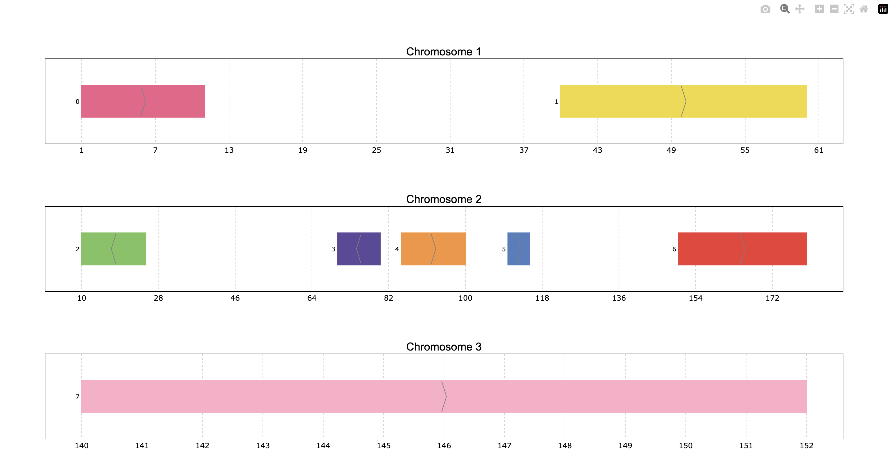

Interactive navigation is intuitive:

* Hover over intervals to see their details in a **tooltip**
* Click and drag to zoom in on a region.
* Double-click to reset the zoom level.
* Inspect the rest of buttons on the top-right to see other available actions.

To create a pdf or png image file instead of opening an interactive plot,
use the ``to_file`` parameter of :func:`plot <pyranges_plot.plot>`.

    >>> prp.plot(p, to_file="my_plot.png")

Because we **registered** the plot function, we can also invoke it like a method of the PyRanges object, as
``PyRanges.plot(...)``. This is equivalent to the previous code:

    >>> p.plot(to_file="my_plot.png")

In the figure above, intervals are displayed individually, i.e. each PyRanges row is treated as a separate entity.
To link the intervals instead, as to represent a transcript composed of exons, use the ``id_column`` parameter,
indicating the column name that defines the groups of intervals.

    >>> prp.plot(p, id_col="transcript_id")

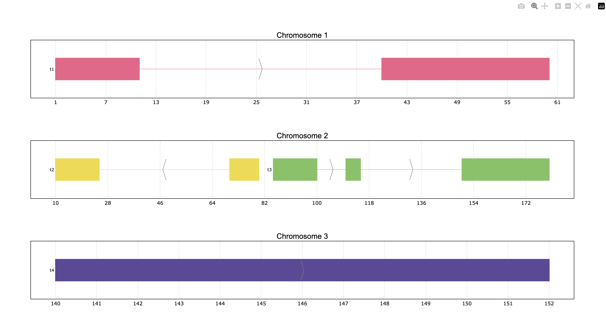

Because the ``id_col`` parameter is used frequently, it can be set as default for all plots using function
:func:`set_id_col <pyranges_plot.set_id_col>`. The following code is equivalent to the previous one:

    >>> prp.set_id_col("transcript_id")
    >>> prp.plot(p)

Selecting what to plot
----------------------
The data above has only 4 interval groups (hereafter, "transcripts") so all of them were included in the plot.
By default, a **maximum of 25 transcripts** are plotted, customizable with the ``max_shown`` parameter of
:func:`plot <pyranges_plot.plot>`.
Below, we can set the maximum number of transcripts show as 2. Note the warning shown:

    >>> prp.plot(p, max_shown=2)

.. image:: images/prp_rtd_03.png

To plot only a subset of the data, use the Pandas/PyRanges object's slicing capabilities.
For example, this plots the intervals on chromosome 2, positive strand, between positions 100 and 200:

    >>> (p.loci[2, '+', 100:200]).plot()

By default, the **limits of plot coordinates** are set to show all the data, and leave some margin at the edges.
This is customizable with the ``limits`` parameter.
The user can decide to change all or some of the coordinate limits leaving the rest as default if desired.
The ``limits`` parameter accepts different input types:

* Dictionary with chromosome names as keys, and a tuple of two integer numbers indicating the limits`` to leave as default).

* Tuple of two integer numbers, which sets the same limits for all plotted chromosomes.

* PyRanges object, wherein Start and End columns define the limits for the corresponding Chromosome.

    >>> prp.plot(p, limit, 100), 2: (60, 20})

.. image:: images/prp_rtd_04.png

To plot with specified limits, use the following code:

    >>> prp.plot(p, limits=(0,300))

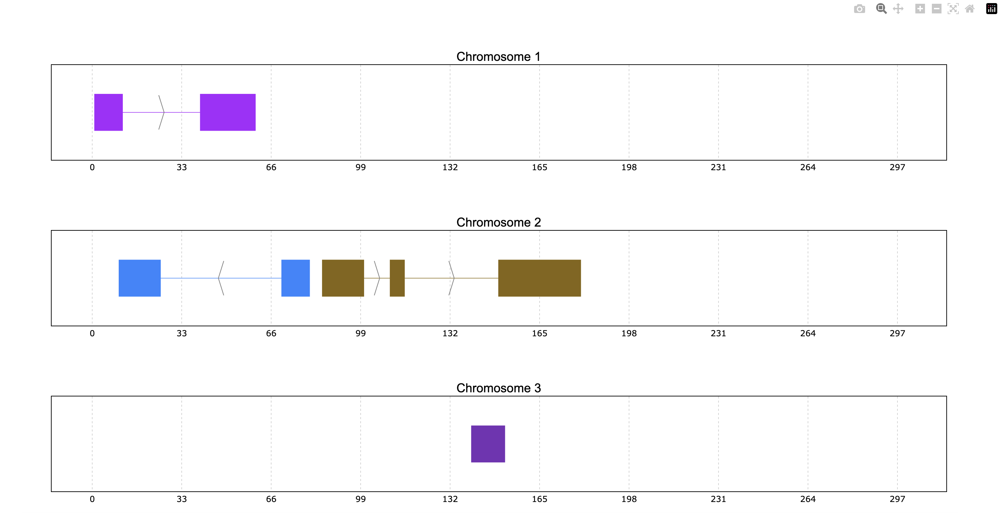

Coloring
--------
By default, the intervals are **colored** according to the ID column
(``transcript_id`` in this case,  previously set as default with :func:`set_id_col <pyranges_plot.set_id_col>`).

We can select any other column to color the intervals by using the ``color_col`` parameter
of :func:`plot <pyranges_plot.plot>`.
For example, let's color by the Strand column:

    >>> prp.plot(p, color_col="Strand")

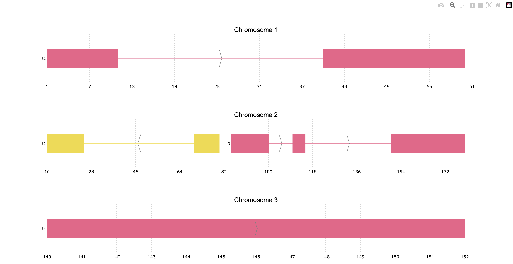

Now the "+" strand transcripts are displayed in one color and the ones on the "-" strand in another color.
Note that pyranges_plot used its default color scheme, and mapped each value in the  ``color_col`` column to a color.

The  **colormap** parameter of :func:`plot <pyranges_plot.plot>` centralizes coloring customization.
It is a versatile parameter, accepting many different types of input.
Using a dictionary allows to exert full control over the coloring, explicitly setting each value-color pair:

    >>> prp.plot(p, color_col="Strand",
    ...          colormap={"+": "green", "-": "red"})

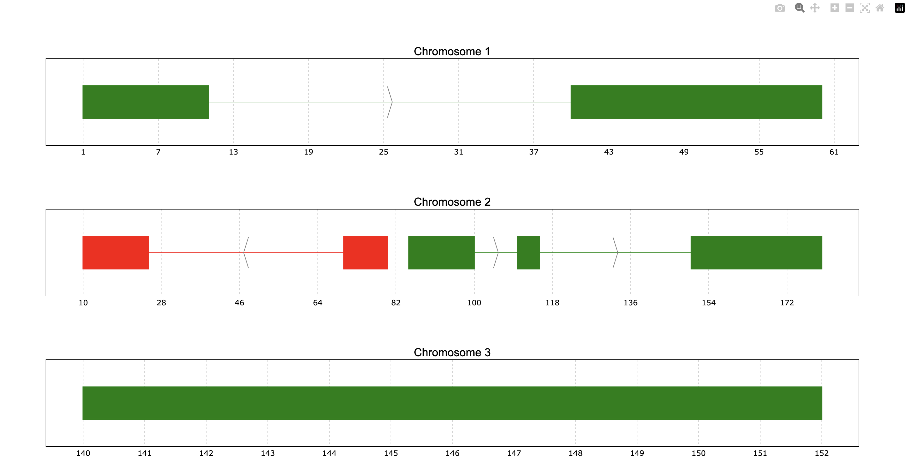

Alternatively, the user may just define the sequence of colors used
(letting pyranges_plot pick which color to assign to each value).
One can provide a list of colors in hex or rgb; or a string recognized as the name of an available
Matplotlib or Plotly colormap;
or an actual Matplotlib or Plotly colormap object. Below, we invoke the "Dark2" Matplotlib colormap:

    >>> prp.plot(p, colormap="Dark2")

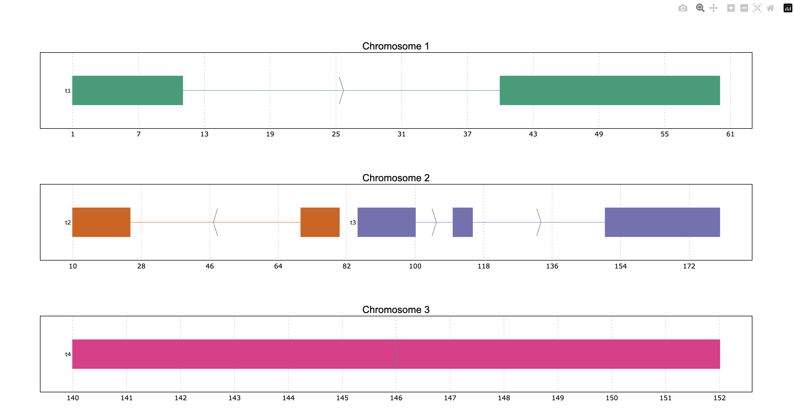

To improve the clarity of the plot, we can enable a legend that labels each color, making it easier 
to interpret the intervals based on their assigned colors. This can be done by setting the 
**legend** parameter of :func:`plot <pyranges_plot.plot>` as True:

    >>> prp.plot(p, colormap="Dark2", legend=True)

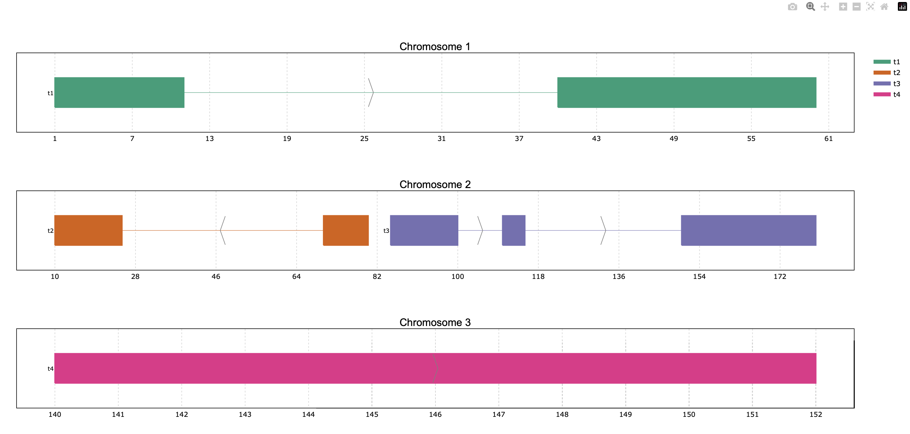

In this section, we have seen how to color intervals based on their attributes.
Next, we will see how to customize the appearance of the plot itself.

Appearance customization options: cheatsheet
--------------------------------------------

A wide range of **options** are available to customize appearance, as summarized below:

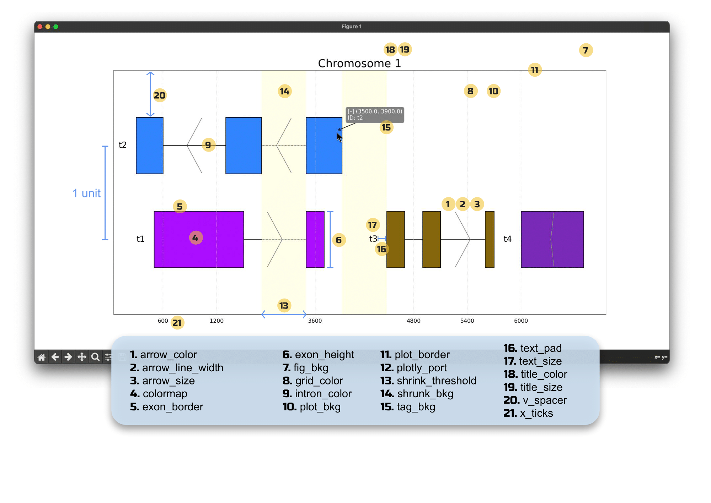

These options can be provided as parameters to the :func:`plot <pyranges_plot.plot>` function, or
set as default beforehand. Let's see an example of providing them as parameters:

    >>> prp.plot(p, plot_bkg="rgb(173, 216, 230)", plot_border="#808080", title_color="magenta")

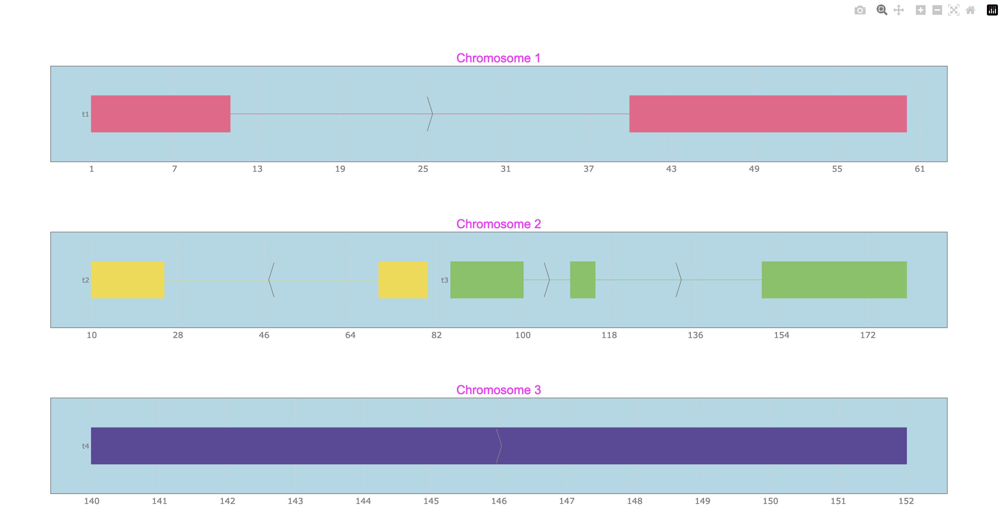

To instead set these options as default, use the :func:`set_options <pyranges_plot.set_options>` function:

    >>> prp.set_options('plot_bkg', 'rgb(173, 216, 230)')
    >>> prp.set_options('plot_border', '#808080')
    >>> prp.set_options('title_color', 'magenta')
    >>> prp.plot(p)  # this will now open a plot identical to the previous one

To inspect the current default options, use the
:func:`print_options <pyranges_plot.print_options>` function.
Note that any modified values from the built-in defaults will be marked with an asterisk (*):

    >>> prp.print_options()
    +------------------+--------------------+---------+--------------------------------------------------------------+
    |     Feature      |       Value        | Edited? |                         Description                          |
    +------------------+--------------------+---------+--------------------------------------------------------------+
    |     colormap     |       popart       |         | Sequence of colors to assign to every group of intervals     |
    |                  |                    |         | sharing the same “color_col” value. It can be provided as a  |
    |                  |                    |         | Matplotlib colormap, a Plotly color sequence (built as       |
    |                  |                    |         | lists), a string naming the previously mentioned color       |
    |                  |                    |         | objects from Matplotlib and Plotly, or a dictionary with     |
    |                  |                    |         | the following structure {color_column_value1: color1,        |
    |                  |                    |         | color_column_value2: color2, ...}. When a specific           |
    |                  |                    |         | color_col value is not specified in the dictionary it will   |
    |                  |                    |         | be colored in black.                                         |
    |   exon_border    |         |         | Color of the interval's rectangle border.                    |
    |     fig_bkg      |       white        |         | Bakground color of the whole figure.                         |
    |    grid_color    |     lightgrey      |         | Color of x coordinates grid lines.                           |
    |     plot_bkg     | rgb(173, 216, 230) |    *    | Background color of the plots.                               |
    |   plot_border    |      #808080       |    *    | Color of the line delimiting the plots.                      |
    |    shrunk_bkg    |    lightyellow     |         | Color of the shrunk region background.                       |
    |     tag_bkg      |        grey        |         | Background color of the tooltip annotation for the gene in   |
    |                  |                    |         | Matplotlib.                                                  |
    |   title_color    |      magenta       |    *    | Color of the plots' titles.                                  |
    |    title_size    |         18         |         | Size of the plots' titles.                                   |
    |     x_ticks      |         |         | Int, list or dict defining the x_ticks to be displayed.      |
    |                  |                    |         | When int, number of ticks to be placed on each plot. When    |
    |                  |                    |         | list, it corresponds to de values used as ticks. When dict,  |
    |                  |                    |         | the keys must match the Chromosome values of the data,       |
    |                  |                    |         | while the values can be either int or list of int; when int  |
    |                  |                    |         | it corresponds to the number of ticks to be placed; when     |
    |                  |                    |         | list of int it corresponds to de values used as ticks. Note  |
    |                  |                    |         | that when the tick falls within a shrunk region it will not  |
    |                  |                    |         | be diplayed.                                                 |
    +------------------+--------------------+---------+--------------------------------------------------------------+
    |   arrow_color    |        grey        |         | Color of the arrow indicating strand.                        |
    | arrow_line_width |         1          |         | Line width of the arrow lines                                |
    |    arrow_size    |       0.006        |         | Float corresponding to the fraction of the plot or int       |
    |                  |                    |         | corresponding to the number of positions occupied by a       |
    |                  |                    |         | direction arrow.                                             |
    |   exon_height    |        0.6         |         | Height of the exon rectangle in the plot.                    |
    |   intron_color   |         |         | Color of the intron lines, the color of the       |
    |                  |                    |         | first interval will be used.                                 |
    |     text_pad     |       0.005        |         | Space where the id annotation is placed beside the           |
    |                  |                    |         | interval. When text_pad is float, it represents the          |
    |                  |                    |         | percentage of the plot space, while an int pad represents    |
    |                  |                    |         | number of positions or base pairs.                           |
    |    text_size     |         10         |         | Fontsize of the text annotation beside the intervals.        |
    |     v_spacer     |        0.5         |         | Vertical distance between the intervals and plot border.     |
    +------------------+--------------------+---------+--------------------------------------------------------------+
    |   plotly_port    |        8050        |         | Port to run plotly app.                                      |
    | shrink_threshold |        0.01        |         | Minimum length of an intron or intergenic region in order    |
    |                  |                    |         | for it to be shrunk while using the “shrink” feature. When   |
    |                  |                    |         | threshold is float, it represents the fraction of the plot   |
    |                  |                    |         | space, while an int threshold represents number of           |
    |                  |                    |         | positions or base pairs.                                     |
    +------------------+--------------------+---------+--------------------------------------------------------------+

To reset options to built-in defaults,  use :func:`reset_options <pyranges_plot.reset_options>`.
By default, it will reset all options. Providing arguments, you can select which options to reset:

    >>> prp.reset_options('plot_background')  # reset one feature
    >>> prp.reset_options(['plot_border', 'title_color'])  # reset a few features
    >>> prp.reset_options()  # reset all features

Built-in and custom themes
--------------------------

A pyranges_plot **theme** is a collection of options for appearance customization (those displayed above
with :func:`print_options <pyranges_plot.print_options>`) each with a set value.
Themes are implemented as dictionaries, that are passed to the :func:`set_theme <pyranges_plot.set_theme>` function.
In practice, setting a theme is equivalent to setting options like we did above
with :func:`set_options <pyranges_plot.set_options>`, but with a single command.

For example, below we create a theme corresponding to the appearance of our last plot:

    >>> my_theme = {
    ...     "plot_bkg": "rgb(173, 216, 230)",
    ...     "plot_border": "#808080",
    ...     "title_color": "magenta"
    ... }
    >>> prp.set_theme(my_theme)
    >>> prp.plot(p)  # this will now open a plot identical to the previous one

Pyranges_plot comes with a few built-in themes, listed in the :func:`set_theme <pyranges_plot.set_theme>` function's
documentation. For example, here's the "dark" theme:

    >>> prp.set_theme('dark')
    >>> prp.plot(p)

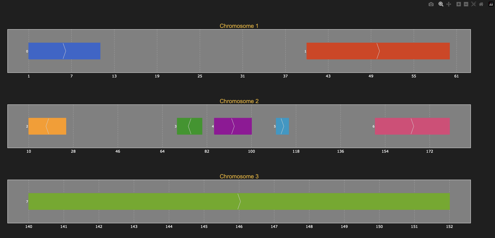

To reset the theme, you can resort again to :func:`reset_options <pyranges_plot.reset_options>`.

Managing space: packed/unpacked, shrink
---------------------------------------

By default, pyranges_plot tries to save as much vertical space as possible,
so the transcripts are placed one beside the other, in a "packed" disposition.
To instead display one transcript per row, set the ``packed`` parameter as ``False``:

.. code-block::

    prp.plot(p, packed=False, legend = False)

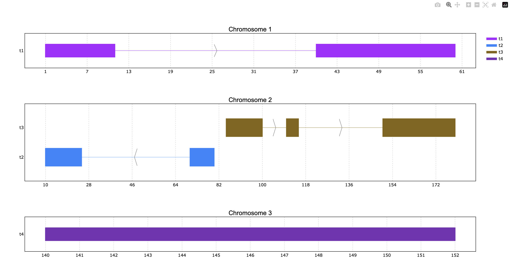

Pyranges_plot offers the option to reduce horizontal space, occupied by introns or intergenic regions,
by activating the ``shrink`` parameter.
The  ``shrink_threshold`` determines the minimum length of a region without visible intervals to be shrunk.
When a float is provided, it will be interpreted as a fraction of the visible coordinate limits,
while when an int is given it will be interpreted as number of base pairs.

.. code-block::

    ppp = prp.example_data.p3
    print(ppp)

.. code-block::

    index    |    Chromosome    Strand    Start    End      transcript_id
    int64    |    object        object    int64    int64    object
    -------  ---  ------------  --------  -------  -------  ---------------
    0        |    1             +         90       92       t1
    1        |    1             +         61       64       t1
    2        |    1             +         104      113      t1
    3        |    1             +         228      229      t1
    ...      |    ...           ...       ...      ...      ...
    16       |    2             -         42       46       t5
    17       |    2             -         37       40       t5
    18       |    2             +         60       70       t6
    19       |    2             +         80       90       t6
    PyRanges with 20 rows, 5 columns, and 1 index columns.
    Contains 2 chromosomes and 2 strands.

.. code-block::

    prp.plot(ppp, shrink=True)

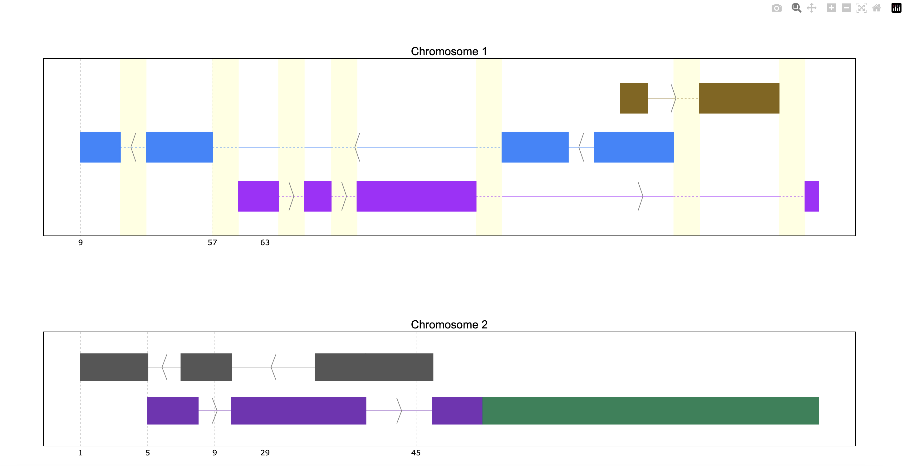

.. code-block::

    prp.plot(ppp, shrink=True, shrink_threshold=0.2)

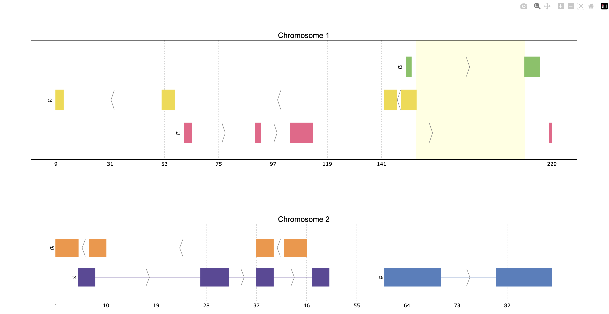

Showing mRNA structure
----------------------

A familiar visualization to many bioinformaticians involves showing the mRNA structure with coding sequences (CDS)
displayed thicker than UTR (untranslated) regions. This is achieved by setting the ``thick_cds`` parameter to ``True``.
Note that data must be coded like standard GFF/GTF files,
with different rows for exons and for CDS, wherein CDS are subsets of exons. A "Feature" column must be present
and contain "exon" or "CDS" values:

.. code-block::

    pp = prp.example_data.p2
    print(pp)

.. code-block::

    index    |    Chromosome    Strand    Start    End      transcript_id    feature1    feature2    Feature
    int64    |    int64         object    int64    int64    object           object      object      object
    -------  ---  ------------  --------  -------  -------  ---------------  ----------  ----------  ---------
    0        |    1             +         1        11       t1               1           A           exon
    1        |    1             +         40       60       t1               1           A           exon
    2        |    2             -         10       25       t2               1           B           CDS
    3        |    2             -         70       80       t2               1           B           CDS
    ...      |    ...           ...       ...      ...      ...              ...         ...         ...
    10       |    4             -         30500    30700    t5               2           E           CDS
    11       |    4             -         30647    30700    t5               2           E           exon
    12       |    4             +         29850    29900    t6               2           F           CDS
    13       |    4             +         29970    30000    t6               2           F           CDS
    PyRanges with 14 rows, 8 columns, and 1 index columns.
    Contains 4 chromosomes and 2 strands.

.. code-block::

    prp.plot(pp, thick_cds=True)

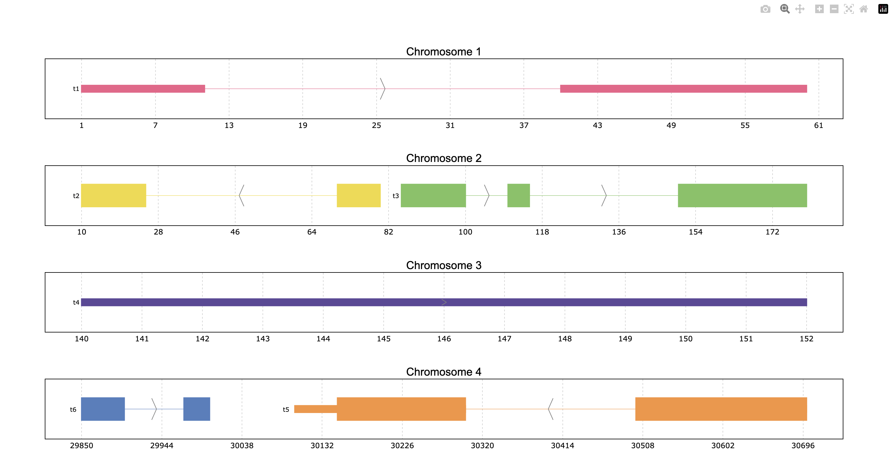

Displaying multiple PyRanges objects
------------------------------------

In some cases, the data intervals might overlap. An example could be when some intervals in
the PyRanges object correspond to exons and others correspond to "GCA" appearances. For such
cases, the ``thickness_col`` and ``depth_col`` parameters are implemented.

The :func:`plot <pyranges_plot.plot>` function can accept more than one PyRanges object, provided as a list.
In this case, pyranges_plot will display them in the same plot, one on top of the other, for each common chromosome.
The intervals of different PyRanges object are separated by a vertical spacer.

Let's see an example with two PyRanges objects, mapping the occurrences of two amino acids, alanine and cysteine:

.. code-block::

    p_ala = prp.example_data.p_ala
    p_cys = prp.example_data.p_cys

    print(p_ala)
    print(p_cys)

.. code-block::

      index  |      Start      End    Chromosome  id        trait1    trait2      depth
      int64  |      int64    int64         int64  object    object    object      int64
    -------  ---  -------  -------  ------------  --------  --------  --------  -------
          0  |         10       20             1  gene1     exon      gene_1          0
          1  |         50       75             1  gene1     exon      gene_1          0
          2  |         90      130             1  gene1     exon      gene_1          0
          3  |         13       16             1  gene1     aa        Ala             1
          4  |         60       63             1  gene1     aa        Ala             1
          5  |         72       75             1  gene1     aa        Ala             1
          6  |        120      123             1  gene1     aa        Ala             1
    PyRanges with 7 rows, 7 columns, and 1 index columns.
    Contains 1 chromosomes.

      index  |      Start      End    Chromosome  id        trait1    trait2      depth
      int64  |      int64    int64         int64  object    object    object      int64
    -------  ---  -------  -------  ------------  --------  --------  --------  -------
          0  |         10       20             1  gene1     exon      gene_1          0
          1  |         50       75             1  gene1     exon      gene_1          0
          2  |         90      130             1  gene1     exon      gene_1          0
          3  |         15       18             1  gene1     aa        Cys             1
          4  |         55       58             1  gene1     aa        Cys             1
          5  |         62       65             1  gene1     aa        Cys             1
          6  |        100      103             1  gene1     aa        Cys             1
          7  |        110      113             1  gene1     aa        Cys             1
    PyRanges with 8 rows, 7 columns, and 1 index columns.
    Contains 1 chromosomes.

.. code-block::

    prp.plot([p_ala, p_cys])

When providing multiple PyRanges objects, it is useful to differentiate them in the plot. The ``y_labels`` parameter
allows to provide a list of strings, one for each PyRanges object, to be displayed on the left side of the plot:

.. code-block::

    prp.plot(
        [p_ala, p_cys],
        y_labels=["pr Alanine", "pr Cysteine"]
    )

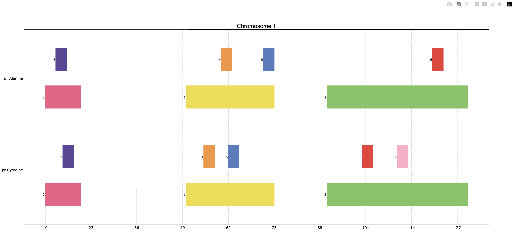

Customizing depth and thickness
-------------------------------

When dealing with overlapping intervals (e.g. see data above), the default visualization may fail to show
relevant information, because some intervals are hidden behind others. To address this, the
``depth_col`` parameter can be used to highlight overlapping intervals. This parameter accepts a
column name from the PyRanges object, which must contain integer values. The higher the value, the
closer the interval will be to the top of the plot, ensuring its visibility:

.. code-block::

    prp.plot(
        [p_ala, p_cys],
        id_col="id",
        y_labels=["pr Alanine", "pr Cysteine"],
        depth_col="depth"
    )

Another way to highlight overlapping regions is by playing with the height (or thickness) of the blocks representing
intervals. This is achieved by using the ``thickness_col`` parameter, which defines a data column name whose values
determine thickness of the corresponding intervals:

.. code-block::

    prp.plot(
        [p_ala, p_cys],
        id_col="id",
        color_col="trait1",
        y_labels=["pr Alanine", "pr Cysteine"],
        thickness_col="trait1",
    )

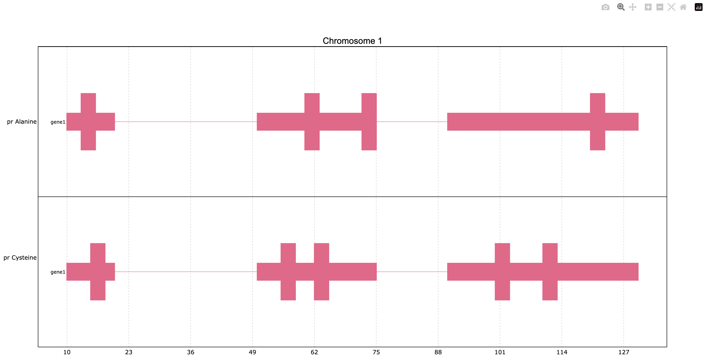

Additional information: tooltips and titles
-------------------------------------------

In interactive plots there is the option of showing information about the gene when the
mouse is placed over its structure. This information always shows the gene's strand if
it exists, the start and end coordinates and the ID. To add information contained in other
dataframe columns to the tooltip, a string should be given to the ``tooltip`` parameter. This
string must contain the desired column names within curly brackets as shown below.

Similarly, the title of the chromosome plots can be customized giving the desired string to
the ``title_chr`` parameter, where the correspondent chromosome value of the data is referred
to as {chrom}. An example could be the following:

.. code-block::

    prp.plot(
        p,
        tooltip="first feature: {feature1}\nsecond feature: {feature2}",
        title_chr='Chr: {chrom}'
        )

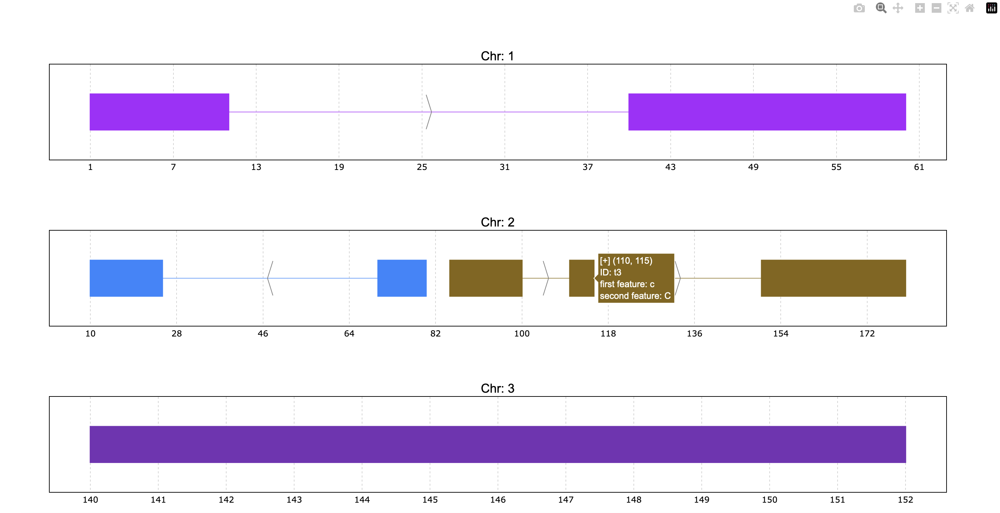

Dealing with vcf files
----------------------

While PyRanges Plot is widely recognized for its robust capabilities in visualizing and managing 
gene annotations, its functionality extends well beyond this. PyRanges Plot also provides 
versatile tools for working with Variant Call Format (VCF) files, a standard file format used 
for storing genetic variant information. This includes parsing VCF files, handling complex metadata 
and visualizing genetic variants alongside gene annotations.

To begin, we need to set **Plotly** as the rendering engine for visualizing the data. Then, we can load 
an example annotation in GFF3 format, which consists of a portion of the genome annotation of Homo 
sapiens chromosome 1:

.. code-block::

    >>> prp.set_engine("plotly")
    >>> ann = prp.example_data.ncbi_gff()
    >>> ann
    index    |    Chromosome    Source         Feature     Start      End        Score     Strand      Frame     frame     ID                          logic_name           Name             ...
    int64    |    category      object         category    int64      int64      object    category    object    object    object                      object               object           ...
    -------  ---  ------------  -------------  ----------  ---------  ---------  --------  ----------  --------  --------  --------------------------  -------------------  ---------------  -----
    0        |    1             havana         ncRNA_gene  173851423  173868940  .         -           .         .         gene:ENSG00000234741        havana_homo_sapiens  GAS5             ...
    1        |    1             havana_tagene  lnc_RNA     173851423  173867989  .         -           .         .         transcript:ENST00000827943  nan                  GAS5-292         ...
    2        |    1             havana_tagene  exon        173851423  173851602  .         -           .         .         nan                         nan                  ENSE00004240426  ...
    3        |    1             havana_tagene  exon        173859207  173859305  .         -           .         .         nan                         nan                  ENSE00004240438  ...
    ...      |    ...           ...            ...         ...        ...        ...       ...         ...       ...       ...                         ...                  ...              ...
    2009     |    1             havana         CDS         173947368  173947582  .         -           .         0         CDS:ENSP00000356667         nan                  nan              ...
    2010     |    1             havana         lnc_RNA     173938575  173941449  .         -           .         .         transcript:ENST00000479099  nan                  RC3H1-203        ...
    2011     |    1             havana         exon        173938575  173938871  .         -           .         .         nan                         nan                  ENSE00001445398  ...
    2012     |    1             havana         exon        173941264  173941449  .         -           .         .         nan                         nan                  ENSE00001946317  ...
    PyRanges with 2013 rows, 28 columns, and 1 index columns. (16 columns not shown: "biotype", "description", "gene_id", ...).
    Contains 1 chromosomes and 1 strands.

Next, let's load a VCF file, which contains variant information for Homo sapiens. This file is 
provided as part of the example dataset and can be loaded into memory as follows:

.. code-block::

    >>> vcf = prp.example_data.ncbi_vcf()
    >>> vcf
    index    |    Chromosome    Start     ID            REF       ALT       QUAL      FILTER      ...
    int64    |    object        int32     object        object    object    object    category    ...
    -------  ---  ------------  --------  ------------  --------  --------  --------  ----------  -----
    0        |    1             943995    rs761448939   C         G,T       nan       .           ...
    1        |    1             964512    rs756054473   C         A,T       nan       .           ...
    2        |    1             976215    rs7417106     A         C,G,T     nan       .           ...
    3        |    1             1013983   rs1644247121  G         A         nan       .           ...
    ...      |    ...           ...       ...           ...       ...       ...       ...         ...
    242182   |    Y             2787592   rs104894975   A         T         nan       .           ...
    242183   |    Y             2787600   rs104894977   G         A         nan       .           ...
    242184   |    Y             7063898   rs199659121   A         T         nan       .           ...
    242185   |    Y             12735725  rs778145751   TAAGT     T         nan       .           ...
    PyRanges with 242186 rows, 9 columns, and 1 index columns. (2 columns not shown: "INFO", "End").
    Contains 25 chromosomes.

Above, we leveraged the builtin example data. In real use cases, you would load data from a file, 
using :func:`read_vcf() <pyranges_plot.vcf.read_vcf>`.

By default, :func:`read_vcf() <pyranges_plot.vcf.read_vcf>` generates a PyRanges object that includes all the columns extracted 
from the VCF file. Additionally, it adds or modifies the following three columns, required to be a Pyranges object:

* **Chromosome**: The chromosome name.
* **Start**: The start position of the variant.
* **End**: The end position of the variant.

The INFO column in the VCF file contains a wealth of additional information, often encoded as key-value 
pairs separated by semicolons. However, in its current form, this column is not readily interpretable 
or easy to analyze due to its compact format. Fortunately, you can easily manipulate the INFO column to 
expand and extract this embedded information into separate, more accessible columns using the 
:func:`split_fields() <pyranges_plot.vcf.split_fields>` function:

.. code-block::

    >>> vcf_split = prp.vcf.split_fields(vcf,target_cols="INFO",field_sep=";")
    >>> vcf_split
    index    |    Chromosome    Start     ID            REF       ALT       QUAL      FILTER      End       INFO_0     INFO_1     INFO_2                  INFO_3                  ...
    int64    |    object        int32     object        object    object    object    category    int32     object     object     object                  object                  ...
    -------  ---  ------------  --------  ------------  --------  --------  --------  ----------  --------  ---------  ---------  ----------------------  ----------------------  -----
    0        |    1             943995    rs761448939   C         G,T       nan       .           943996    dbSNP_156  TSA=SNV    E_Freq                  E_Cited                 ...
    1        |    1             964512    rs756054473   C         A,T       nan       .           964513    dbSNP_156  TSA=SNV    E_Freq                  E_Cited                 ...
    2        |    1             976215    rs7417106     A         C,G,T     nan       .           976216    dbSNP_156  TSA=SNV    E_Freq                  E_1000G                 ...
    3        |    1             1013983   rs1644247121  G         A         nan       .           1013984   dbSNP_156  TSA=SNV    E_Phenotype_or_Disease  CLIN_pathogenic         ...
    ...      |    ...           ...       ...           ...       ...       ...       ...         ...       ...        ...        ...                     ...                     ...
    242182   |    Y             2787592   rs104894975   A         T         nan       .           2787593   dbSNP_156  TSA=SNV    E_Cited                 E_Phenotype_or_Disease  ...
    242183   |    Y             2787600   rs104894977   G         A         nan       .           2787601   dbSNP_156  TSA=SNV    E_Cited                 E_Phenotype_or_Disease  ...
    242184   |    Y             7063898   rs199659121   A         T         nan       .           7063899   dbSNP_156  TSA=SNV    E_Freq                  E_Cited                 ...
    242185   |    Y             12735725  rs778145751   TAAGT     T         nan       .           12735726  dbSNP_156  TSA=indel  E_Freq                  E_Cited                 ...
    PyRanges with 242186 rows, 28 columns, and 1 index columns. (16 columns not shown: "INFO_4", "INFO_5", "INFO_6", ...).
    Contains 25 chromosomes.

Note that the column names generated when splitting the INFO column are assigned sequentially, prefixed with 
the name of the original column (e.g., INFO_0, INFO_1, and so on). If you prefer more descriptive column names, 
you have two options. You can use the **col_name_sep** parameter to automatically extract the column names written 
in the VCF file (e.g., key-value pairs like DP=10 will produce a column named DP). Alternatively, you can use 
the **col_names** parameter to manually specify each column name, giving you full control over the naming scheme. 
Both approaches allow you to tailor the resulting column names to your specific needs, enhancing the readability 
and usability of your data.In this case, we are going to use the col_name_sep parameter to extract column names 
directly from the VCF file:

.. code-block::

    >>> vcf_split = prp.vcf.split_fields(vcf,target_cols="INFO",field_sep=";",col_name_sep="=")
    >>> vcf_split
    index    |    Chromosome    Start     ID            REF       ALT       QUAL      FILTER      End       INFO_0     TSA       INFO_2                  INFO_3                  ...
    int64    |    object        int32     object        object    object    object    category    int32     object     object    object                  object                  ...
    -------  ---  ------------  --------  ------------  --------  --------  --------  ----------  --------  ---------  --------  ----------------------  ----------------------  -----
    0        |    1             943995    rs761448939   C         G,T       nan       .           943996    dbSNP_156  SNV       E_Freq                  E_Cited                 ...
    1        |    1             964512    rs756054473   C         A,T       nan       .           964513    dbSNP_156  SNV       E_Freq                  E_Cited                 ...
    2        |    1             976215    rs7417106     A         C,G,T     nan       .           976216    dbSNP_156  SNV       E_Freq                  E_1000G                 ...
    3        |    1             1013983   rs1644247121  G         A         nan       .           1013984   dbSNP_156  SNV       E_Phenotype_or_Disease  CLIN_pathogenic         ...
    ...      |    ...           ...       ...           ...       ...       ...       ...         ...       ...        ...       ...                     ...                     ...
    242182   |    Y             2787592   rs104894975   A         T         nan       .           2787593   dbSNP_156  SNV       E_Cited                 E_Phenotype_or_Disease  ...
    242183   |    Y             2787600   rs104894977   G         A         nan       .           2787601   dbSNP_156  SNV       E_Cited                 E_Phenotype_or_Disease  ...
    242184   |    Y             7063898   rs199659121   A         T         nan       .           7063899   dbSNP_156  SNV       E_Freq                  E_Cited                 ...
    242185   |    Y             12735725  rs778145751   TAAGT     T         nan       .           12735726  dbSNP_156  indel     E_Freq                  E_Cited                 ...
    PyRanges with 242186 rows, 31 columns, and 1 index columns. (19 columns not shown: "INFO_4", "INFO_5", "INFO_6", ...).
    Contains 25 chromosomes.

Let's begin plotting! First, we'll select a specific region to focus on and observe the genes within it. For this 
example, the chosen region is 173900000:173920000:

.. code-block::

    >>> reg = ann.loci["1","-",173900000:173920000]
    >>> reg['ID'] = reg['Parent']
    >>> reg
    index    |    Chromosome    Source          Feature          Start      End        Score     Strand      Frame     frame     ID                          logic_name                        ...
    int64    |    category      object          category         int64      int64      object    category    object    object    object                      object                            ...
    -------  ---  ------------  --------------  ---------------  ---------  ---------  --------  ----------  --------  --------  --------------------------  --------------------------------  -----
    1953     |    1             ensembl_havana  gene             173903799  173917327  .         -           .         .         nan        ensembl_havana_gene_homo_sapiens  ...
    1954     |    1             ensembl_havana  mRNA             173903799  173917327  .         -           .         .         gene:ENSG00000117601  nan                               ...
    1955     |    1             ensembl_havana  three_prime_UTR  173903799  173903888  .         -           .         .         transcript:ENST00000367698                         nan                               ...
    1956     |    1             ensembl_havana  exon             173903799  173904065  .         -           .         .         transcript:ENST00000367698                         nan                               ...
    ...      |    ...           ...             ...              ...        ...        ...       ...         ...       ...       ...                         ...                               ...
    1977     |    1             havana          exon             173911979  173912014  .         -           .         .         transcript:ENST00000494024                         nan                               ...
    1978     |    1             havana          exon             173914552  173914919  .         -           .         .         transcript:ENST00000494024                         nan                               ...
    1979     |    1             havana          exon             173915017  173915186  .         -           .         .         transcript:ENST00000494024                         nan                               ...
    1980     |    1             havana          exon             173917218  173917316  .         -           .         .         transcript:ENST00000494024                         nan                               ...
    PyRanges with 28 rows, 28 columns, and 1 index columns. (17 columns not shown: "Name", "biotype", "description", ...).
    Contains 1 chromosomes and 1 strands.

Similarly, we need to focus on the SNPs within the selected region:

.. code-block::

    >>> coord_vcf = vcf_split.loci["1",173900000:173920000]
    >>> coord_vcf
    index    |    Chromosome    Start      ID            REF         ALT       QUAL      FILTER      End        INFO_0     TSA       INFO_2                  INFO_3                  ...
    int64    |    object        int32      object        object      object    object    category    int32      object     object    object                  object                  ...
    -------  ---  ------------  ---------  ------------  ----------  --------  --------  ----------  ---------  ---------  --------  ----------------------  ----------------------  -----
    12765    |    1             173903891  rs1572084425  A           G         nan       .           173903892  dbSNP_156  SNV       E_Cited                 E_Phenotype_or_Disease  ...
    12766    |    1             173903902  rs121909564   G           A         nan       .           173903903  dbSNP_156  SNV       E_Freq                  E_Cited                 ...
    12767    |    1             173903902  rs2102772927  GGGTTGGCTA  G         nan       .           173903903  dbSNP_156  deletion  E_Cited                 E_Phenotype_or_Disease  ...
    12768    |    1             173903908  rs1572084448  G           T         nan       .           173903909  dbSNP_156  SNV       E_Cited                 E_Phenotype_or_Disease  ...
    ...      |    ...           ...        ...           ...         ...       ...       ...         ...        ...        ...       ...                     ...                     ...
    12856    |    1             173914920  rs1572092195  C           G         nan       .           173914921  dbSNP_156  SNV       E_Phenotype_or_Disease  CLIN_likely_pathogenic  ...
    12857    |    1             173917217  rs199469508   A           G         nan       .           173917218  dbSNP_156  SNV       E_Phenotype_or_Disease  CLIN_pathogenic         ...
    12858    |    1             173917231  rs61736655    G           T         nan       .           173917232  dbSNP_156  SNV       E_Freq                  E_1000G                 ...
    12859    |    1             173917430  rs1658038847  G           C         nan       .           173917431  dbSNP_156  SNV       E_Freq                  E_Cited                 ...
    PyRanges with 95 rows, 31 columns, and 1 index columns. (19 columns not shown: "INFO_4", "INFO_5", "INFO_6", ...).
    Contains 1 chromosomes.

Finally, we are ready to visualize our data. By combining the gene annotation from the selected genomic region with 
the prepared PyRanges object representing the SNPs, we can generate an insightful plot that overlays both datasets. 
Using the prp.plot function, you can pass the gene annotations and the SNPs together to create a detailed visualization. 
or this, simply specify the id_col parameter to indicate the column containing unique identifiers, such as the SNP IDs. 
Here's how you can do it:

.. code-block::

    >>> prp.plot([reg,coord_vcf],id_col='ID')

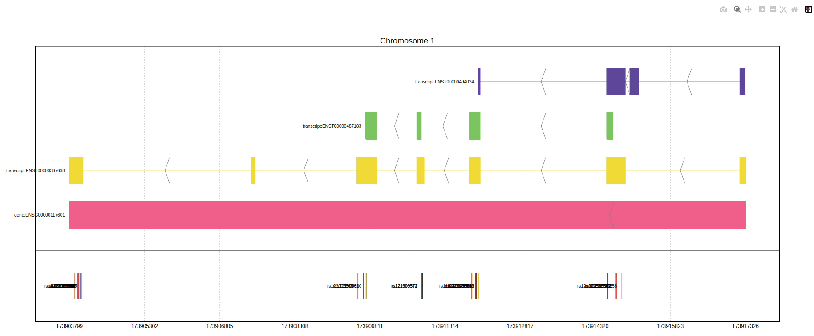

In the figure above, the text displaying the ID of each variant may be misinterpreted due to overlapping with other SNP 
labels. To address this, you can create an artificial column that selectively displays this text only for annotation data 
while omitting it for VCF data:

.. code-block::

    >>> reg["Text_col"]=reg["Parent"]
    >>> coord_vcf['Text_col'] = ''
    >>> prp.plot([reg,coord_vcf],id_col='ID',text = '{Text_col}')

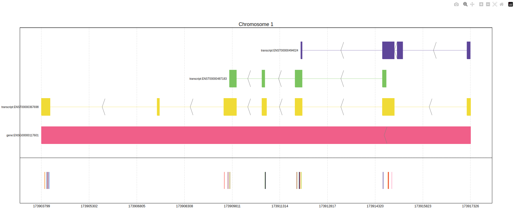

However, genome variant analysis is not limited to simply identifying the positions of variants. You might also want to 
explore the distribution of variants by analyzing the number of variants at each position. With PyRanges Plot, you can achieve 
this by first creating a scatterplot that visualizes these counts, and then including it as input in the **add_aligned_plots**
parameter:

.. code-block::

    >>> import plotly.graph_objects as go
    >>> aligned_traces = [
    ...     (go.Scatter(
    ...         x=[173905000, 173905500, 173906000, 173906500, 173907000, 173907500, 173908000, 173908500, 173909000, 173909500],
    ...         y=[1, 2, 3, 4, 5, 6, 7, 8, 9, 10],
    ...         mode='markers'
    ...     ),{'title': 'Scatterplot', 'title_size': 18, 'title_color': 'green'})
    ... ]
    >>> prp.plot([reg,coord_vcf],id_col='ID',text = '{Text_col}',add_aligned_plots=aligned_traces)

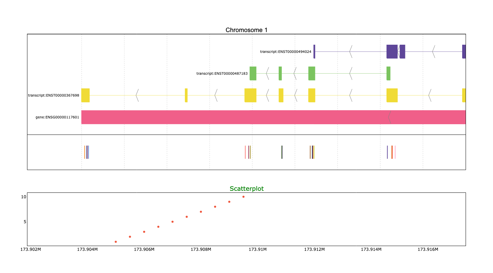

.. warning::

    Be careful! The add_aligned_plots parameter is currently only supported when your input data contains a single chromosome. 
    If your dataset spans multiple chromosomes, you will need to filter it beforehand to focus on a specific chromosome for this 
    feature to work correctly.

As you observed, the add_aligned_plots parameter accepts as input a list of tuples, where each tuple consists of two elements: 
the first is the scatterplot object, and the second is a dictionary for customizing the title of the aligned plot.This dictionary 
allows you to control three title parameters:

* title: The text of the title.
* title_size: The font size of the title.
* title_color: The color of the title text.
* y_space: Determines de distance between the main plot and the aligned plots
* height: Determines the height of the added plot

We already used the options to customise the title., let's now customise the y axis length and the space between these plots:

.. code-block::

    >>> aligned_traces = [
    ...          (go.Scatter(
    ...              x=[173905000, 173905500, 173906000, 173906500, 173907000, 173907500, 173908000, 173908500, 173909000, 173909500],
    ...              y=[1, 2, 3, 4, 5, 6, 7, 8, 9, 10],
    ...              mode='markers'
    ...          ),{'title': 'Scatterplot', 'title_size': 18, 'title_color': 'green', 'height': 0.5, 'y_space': 0.5})
    ... ]
    >>> prp.plot([reg,coord_vcf],id_col='ID',text = '{Text_col}',add_aligned_plots=aligned_traces)

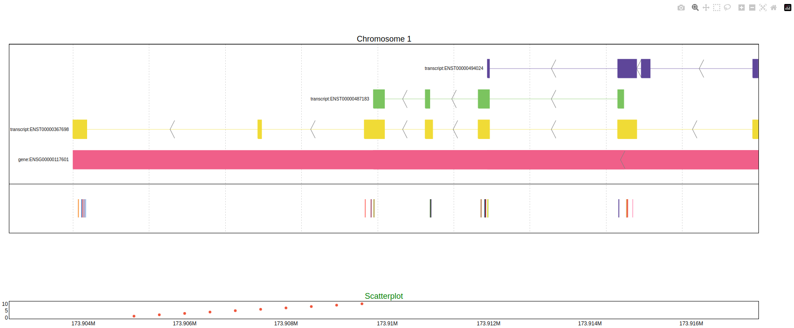

If your dataset is too large to manually create a Plotly scatterplot, Pyranges Plot offers a convenient function called :func:`make_scatter() <pyranges_plot.make_scatter>`. 
This function allows you to automatically generate a scatterplot directly from your data, introducing the numeric column for the
y axis.

First we will use Numpy to create a random Count column

.. code-block::

    >>> import numpy as np
    >>> coord_vcf['Count']=coord_vcf.apply(lambda row: np.random.randint(0, 100), axis=1)

Next, we will use this column to define the y-axis for the plot:

.. code-block::

    >>> aligned = prp.make_scatter(coord_vcf, y='Count')
    >>> prp.plot([reg,coord_vcf],id_col='ID',text = '{Text_col}',add_aligned_plots=[aligned])

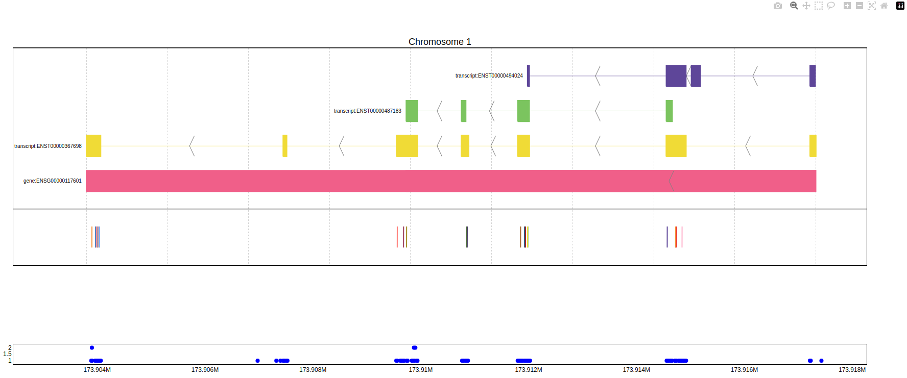

The :func:`make_scatter() <pyranges_plot.make_scatter>` function includes several options that allow you to customize your plot to better fit your needs. For instance, 
you can use the following parameters:

* color_by: Specify a column from your dataset to color the markers based on its values.
* title: Set a custom title for your scatterplot.
* title_size: Adjust the font size of the title for better visibility.
* title_color: Change the color of the title text to match your design preferences.
* size_by: Define a column to dynamically adjust the marker sizes based on its values.
* y_space: Determines de distance between the main plot and the aligned plots
* height: Determines the height of the added plot

These customization options make it easy to generate informative and visually appealing scatterplots tailored to your data.
In our case we are going to color our genetic variants by its type (**TSA** column):

.. code-block::

    >>> aligned = prp.make_scatter(coord_vcf, y='Count',color_by="TSA", title="Human Variants", title_color="Magenta",title_size=18)
    >>> prp.plot([reg,coord_vcf],id_col='ID',text = '{Text_col}',add_aligned_plots=[aligned])

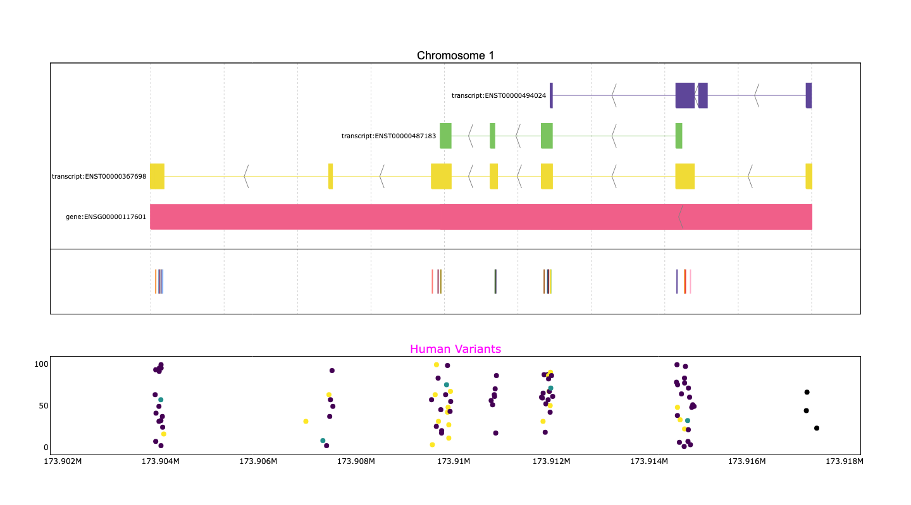

Enhancing PyRanges Plot with External Visualizations
----------------------------------------------------

A typical genomic analysis often involves more than just visualizing genomic intervals. Researchers frequently need to incorporate additional 
plots—potentially using different axes or plot types—to provide context or enhance the interpretation of results.  PyRanges Plot allows you 
to export your plot to a variable by using the **return_plot** parameter. This parameter accepts two values:

* app: Returns a Dash object, which can be integrated into a custom dashboard.
* fig: Returns the figure and axes of the data, enabling direct manipulation or combination with other Plotly figures.

Example:

.. code-block::

    >>> p = prp.plot([reg,coord_vcf],id_col='ID',text = '{Text_col}', return_plot='app')
    >>> p
    <dash.dash.Dash object at 0x73321d74e990>

Imagine you have your VCF plot and want to visualize how many variants are present in your dataset. For instance, first you can export 
the pyranges plot dash object and then you can create a pie chart to display the distribution of variants by type and seamlessly 
integrate it into the PyRanges Plot layout. Below is an example of a PyRanges Plot combined with a horizontally aligned pie chart:

.. code-block::

    p = prp.plot([reg,coord_vcf],id_col='ID',text = '{Text_col}', return_plot='app')

    # Example additional data
    variant_types = ["Missense", "Synonymous", "Nonsense", "Frameshift", "Splice Site"]
    variant_counts = [30, 20, 10, 15, 25]  # Example counts or proportions

    # Create a pie chart
    pie_chart = go.Figure(
        go.Pie(
            labels=variant_types,
            values=variant_counts,
            hoverinfo="label+percent",
            textinfo="label+percent",
        )
    )
    pie_chart.update_layout(title={"text": "Variant Types", "font": {"color": "black", "size": 18}, "x": 0.5},
                        margin=dict(l=10, r=10, t=30, b=10))

    # Access and extend the existing Dash app's layout
    p.layout = html.Div(
        [
            html.Div(
                [
                    html.Div([p.layout], style={"width": "70%", "display": "flex", "justify-content": "center"}),
                    html.Div(
                        [dcc.Graph(figure=pie_chart)],
                        style={
                            "width": "70%",
                            "display": "flex",
                            "align-items": "center",
                            "justify-content": "center",
                        },
                    ),
                ],
                style={"display": "flex", "flex-direction": "row"},  # Arrange side by side
            )
        ]
    )

    # Run the Dash app
    if __name__ == "__main__":
        p.run_server(debug=True)

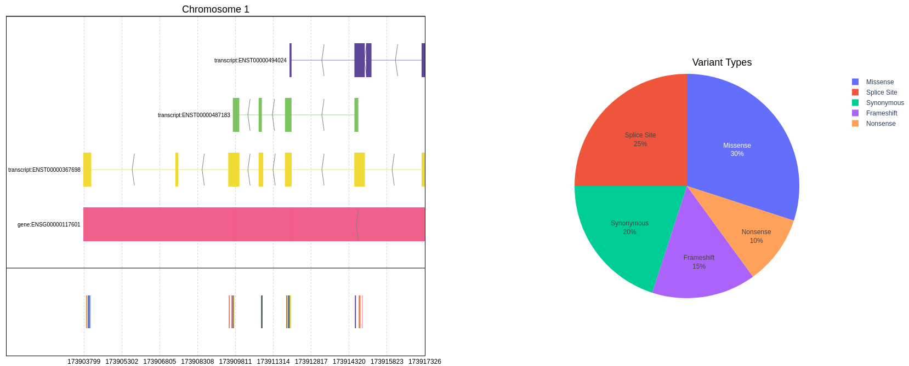

.. warning::
    Hey! This code may cause issues if it is run in an IPython shell. 
    For a smoother experience, consider using a Jupyter Notebook instead.

This layout can also be implemented vertically, allowing you to stack the PyRanges Plot and the pie chart for a clear and intuitive 
visualization. Here's how you can achieve this configuration:

.. code-block::

    p = prp.plot([reg,p_vcf[0]],id_col='ID',text = '{Artificial_col}', return_plot='app')

    # Example additional data
    variant_types = ["Missense", "Synonymous", "Nonsense", "Frameshift", "Splice Site"]
    variant_counts = [30, 20, 10, 15, 25]  # Example counts or proportions

    # Create a pie chart
    pie_chart = go.Figure(
        go.Pie(
            labels=variant_types,
            values=variant_counts,
            hoverinfo="label+percent",
            textinfo="label+percent",
        )
    )
    pie_chart.update_layout(title={"text": "Variant Types", "font": {"color": "black", "size": 18}, "x": 0.5},
                        margin=dict(l=10, r=10, t=30, b=10))

    # Access and extend the existing Dash app's layout
    p.layout = html.Div(
        [
            p.layout,  # Retain the existing layout from prp.plot
            html.Div(
                [
                    dcc.Graph(figure=pie_chart, style={"margin-bottom": "20px"}),
                ],
                style={"display": "flex", "flex-direction": "column"}  # Arrange vertically
            )
        ]
    )

    # Run the Dash app
    if __name__ == "__main__":
        p.run_server(debug=True)

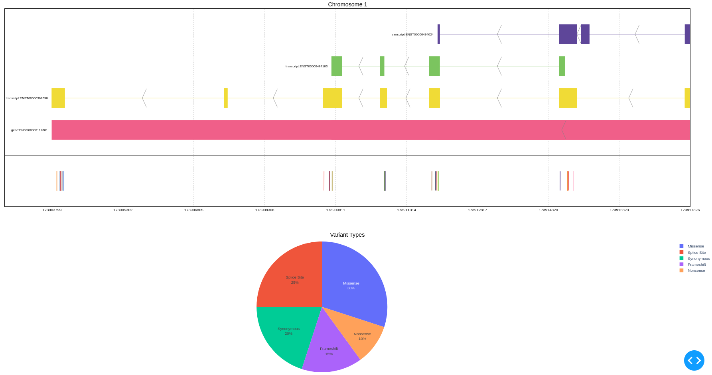