.. _tutorial:

Tutorial
~~~~~~~~

This tutorial assumes some familiarity with pyranges v1.
If necessary, go through its tutorial first: https://pyranges1.readthedocs.io/

.. contents:: Contents of Tutorial
   :depth: 3

Getting started
---------------

The first compulsory step to obtain a plot is setting the **engine**, using function
:func:`set_engine <pyrangeyes.set_engine>` after importing. We also **register** the plot function
using :func:`register_plot <pyrangeyes.register_plot>`, which is optional but convenient:
it allows to use the plot function directly from PyRanges objects (further explained later).

    >>> import pyrangeyes as pe
    >>> pe.set_engine("plotly")  # possible engines: "plotly" and "matplotlib"
    >>> pe.register_plot()

Pyrangeyes centralizes the interface to producing graphics in
the :func:`plot <pyrangeyes.plot>` function. It offers plenty of options to
customize the appearance of the plot, showcased in this tutorial.
To that end, we will use some example data included in the Pyrangeyes package.
Yet, any PyRanges object can be used, e.g. loaded from gff, gtf, bam files.

    >>> p = pe.example_data.p1
    >>> print(p)  # doctest: +ELLIPSIS
      index  |      Chromosome  Strand      Start      End  transcript_id    ...
    ...
    PyRanges with 8 rows, 7 columns, and 1 index columns...
    Contains 3 chromosomes and 2 strands.

By default, :func:`plot <pyrangeyes.plot>` produces an interactive plot. If the Matplotlib engine is selected,
a window appears. If the Plotly engine is selected, a server is automatically opened, and
an address is printed in the console. The plot can be accessed by opening this address in a browser.

    >>> pe.plot(p)

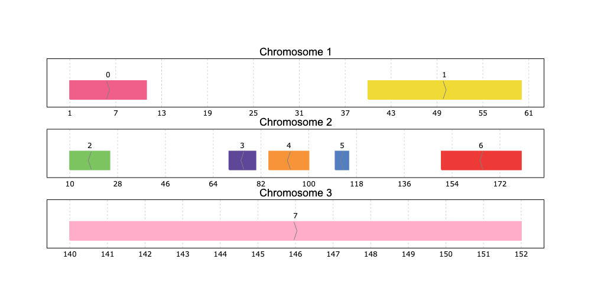

Interactive navigation is intuitive:

* Hover over intervals to see their details in a **tooltip**
* Click and drag to zoom in on a region.
* Double-click to reset the zoom level.
* Inspect the rest of buttons on the top-right to see other available actions.

To create a pdf or png image file instead of opening an interactive plot,
use the ``to_file`` parameter of :func:`plot <pyrangeyes.plot>`.

    >>> pe.plot(p, to_file="my_plot.png")

Because we **registered** the plot function, we can also invoke it like a method of the PyRanges object, as
``PyRanges.plot(...)``. This is equivalent to the previous code:

    >>> p.plot(to_file="my_plot.png")

In the figure above, intervals are displayed individually, i.e. each PyRanges row is treated as a separate entity.
To link the intervals instead, as to represent a transcript composed of exons, use the ``id_column`` parameter,
indicating the column name that defines the groups of intervals.

    >>> pe.plot(p, id_col="transcript_id")

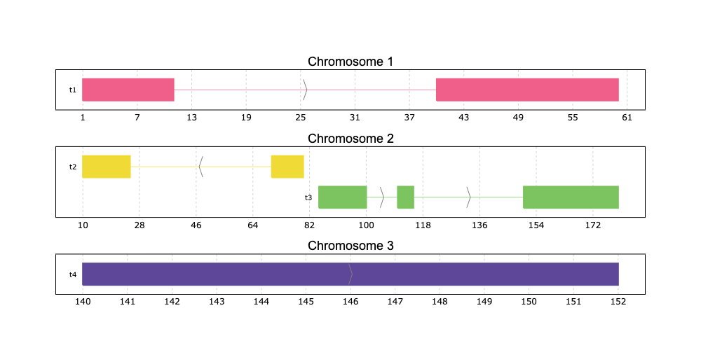

Because the ``id_col`` parameter is used frequently, it can be set as default for all plots using function
:func:`set_id_col <pyrangeyes.set_id_col>`. The following code is equivalent to the previous one:

    >>> pe.set_id_col("transcript_id")
    >>> pe.plot(p)

Selecting what to plot
----------------------
The data above has only 4 interval groups (hereafter, "transcripts") so all of them were included in the plot.
By default, a **maximum of 25 transcripts** are plotted, customizable with the ``max_shown`` parameter of
:func:`plot <pyrangeyes.plot>`.
Below, we can set the maximum number of transcripts show as 2. Note the warning shown:

    >>> pe.plot(p, max_shown=2)

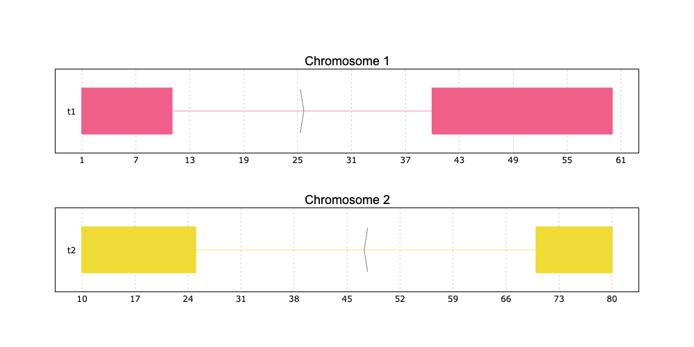

To plot only a subset of the data, use the Pandas/PyRanges object's slicing capabilities.
For example, this plots the intervals on chromosome 2, positive strand, between positions 100 and 200:

    >>> (p.loci[2, '+', 100:200]).plot()

By default, the **limits of plot coordinates** are set to show all the data, and leave some margin at the edges.
This is customizable with the ``limits`` parameter.
The user can decide to change all or some of the coordinate limits leaving the rest as default if desired.
The ``limits`` parameter accepts different input types:

* Dictionary with chromosome names as keys, and a tuple of two integer numbers indicating the limits.
  Either coordinate can be ``None`` to leave that side as default.

* Tuple of two integer numbers, which sets the same limits for all plotted chromosomes.

* PyRanges object, wherein Start and End columns define the limits for the corresponding Chromosome.

    >>> pe.plot(p, limits={1: (None, 100), 2: (60, 200)})

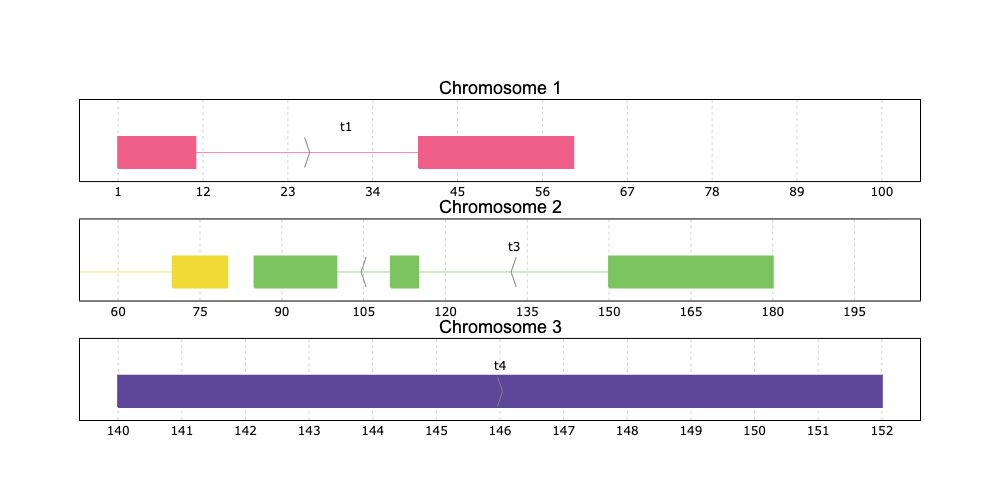

To plot with specified limits, use the following code:

    >>> pe.plot(p, limits=(0,300))

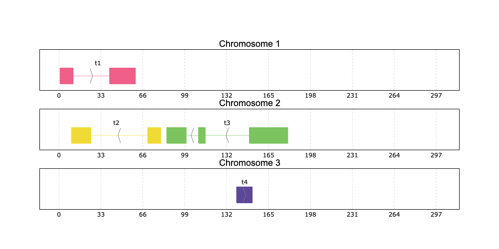

Defining regions for panels
----------------------------

Use ``regions`` to replace the default one-panel-per-chromosome layout with specific panels.
For example, this makes one panel per transcript by using a column name:

    >>> pe.plot(p, regions="transcript_id", color_col="transcript_id")

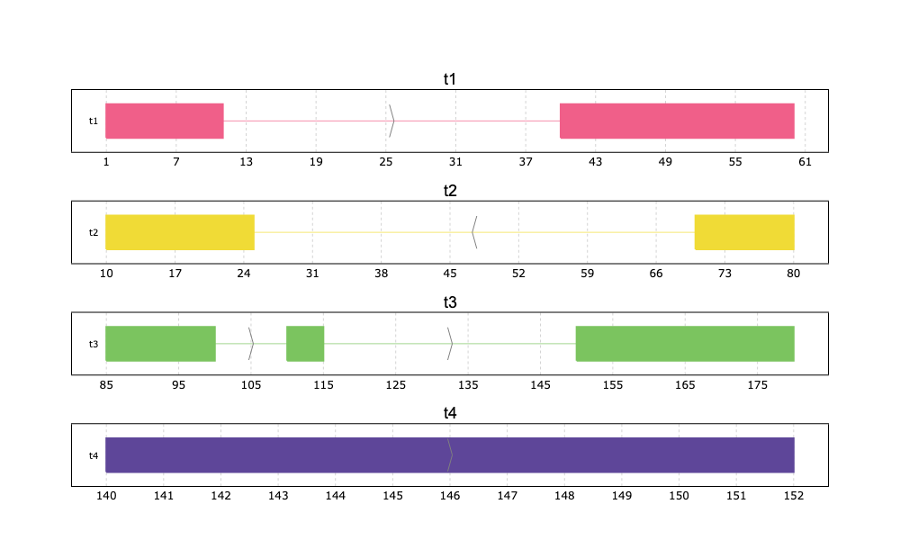

Explicit regions are also supported with ``(chromosome, start, end)`` tuples or PyRanges rows:

    >>> pe.plot(p, regions=[(2, 60, 120), (2, 140, 190), (1, None, None)])

Plotting intervals in strand direction
--------------------------------------

Use ``reverse="auto"`` to mirror panels whose known intervals are all on the negative strand.
Coordinates in ticks and tooltips stay genomic.

    >>> import pyranges1 as pr
    >>> q = pr.PyRanges(
    ...     {
    ...         "Chromosome": ["chr1", "chr1", "chr2", "chr2"],
    ...         "Strand": ["+", "+", "-", "-"],
    ...         "Start": [10, 60, 20, 80],
    ...         "End": [30, 90, 45, 110],
    ...         "tx": ["tx1", "tx1", "tx2", "tx2"],
    ...     }
    ... )
    >>> pe.plot(q, id_col="tx", reverse="auto")

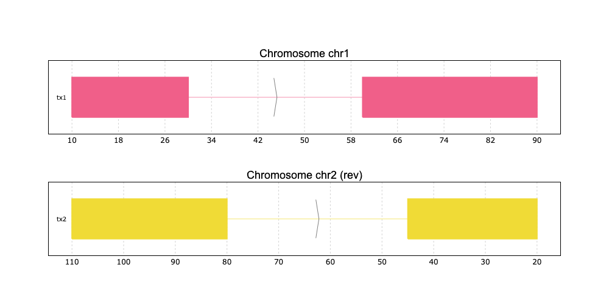

``reverse`` accepts several inputs:

    >>> pe.plot(q, id_col="tx", reverse=True)             # reverse all panels
    >>> pe.plot(q, id_col="tx", reverse=["chr2"])         # reverse selected panels
    >>> pe.plot(q, id_col="tx", reverse={"chr2": True})   # map panels to booleans

Coloring
--------
By default, the intervals are **colored** according to the ID column
(``transcript_id`` in this case,  previously set as default with :func:`set_id_col <pyrangeyes.set_id_col>`).

We can select any other column to color the intervals by using the ``color_col`` parameter
of :func:`plot <pyrangeyes.plot>`.
For example, let's color by the Strand column:

    >>> pe.plot(p, color_col="Strand")

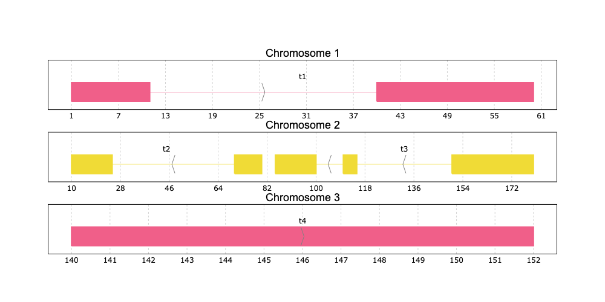

Now the "+" strand transcripts are displayed in one color and the ones on the "-" strand in another color.
Note that pyrangeyes used its default color scheme, and mapped each value in the  ``color_col`` column to a color.

The  **colormap** parameter of :func:`plot <pyrangeyes.plot>` centralizes coloring customization.
It is a versatile parameter, accepting many different types of input. Colors can be hex strings,
rgb strings, or explicit color names such as ``"skyblue"`` and ``"black"``.
Using a dictionary allows to exert full control over the coloring, explicitly setting each value-color pair:

    >>> pe.plot(p, color_col="Strand",
    ...          colormap={"+": "green", "-": "red"})

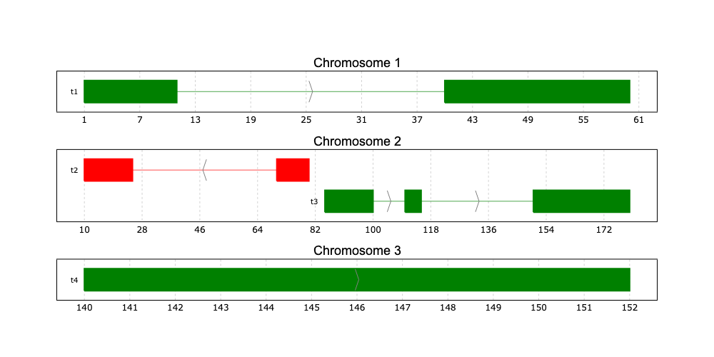

Alternatively, the user may just define the sequence of colors used
(letting pyrangeyes pick which color to assign to each value).
One can provide a list of colors in hex or rgb; or a string recognized as the name of an available
Matplotlib or Plotly colormap;
or an actual Matplotlib or Plotly colormap object. Below, we invoke the "Dark2" Matplotlib colormap:

    >>> pe.plot(p, colormap="Dark2")

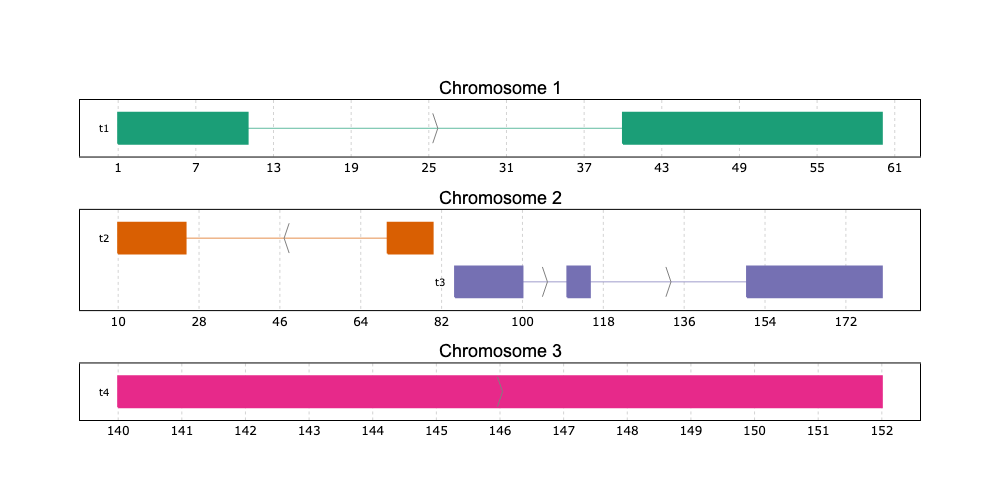

If a column already stores literal colors (for example hex strings), set ``colormap="direct"``
to use those values directly instead of mapping them as categories:

    >>> p["fill"] = ["#8ecae6", "#8ecae6", "#ffb703", "#ffb703", "#219ebc", "#219ebc", "#219ebc", "#fb8500"]
    >>> pe.plot(p, color_col="fill", colormap="direct")

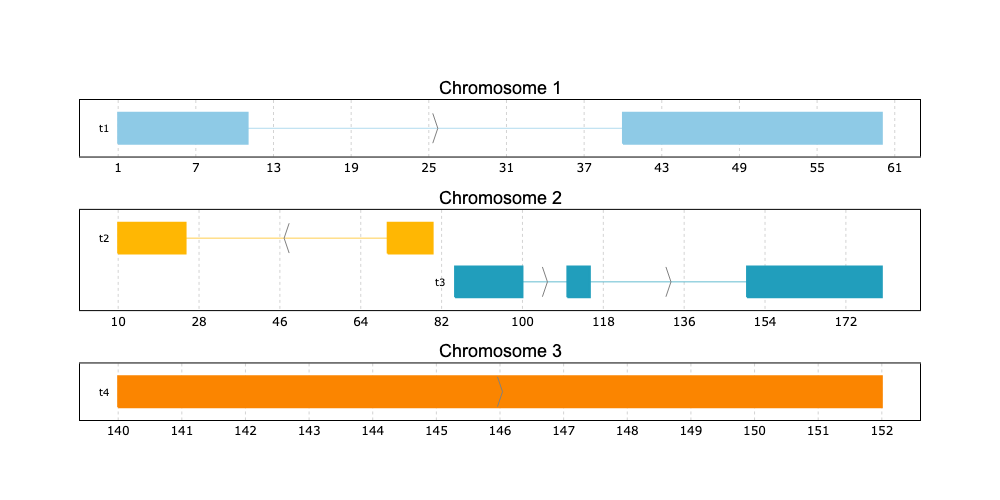

By default, interval outlines use the same resolved color as the fill. For one fixed
outline color, use the ``outline_color`` option:

    >>> pe.plot(p, color_col="Strand", outline_color="black")

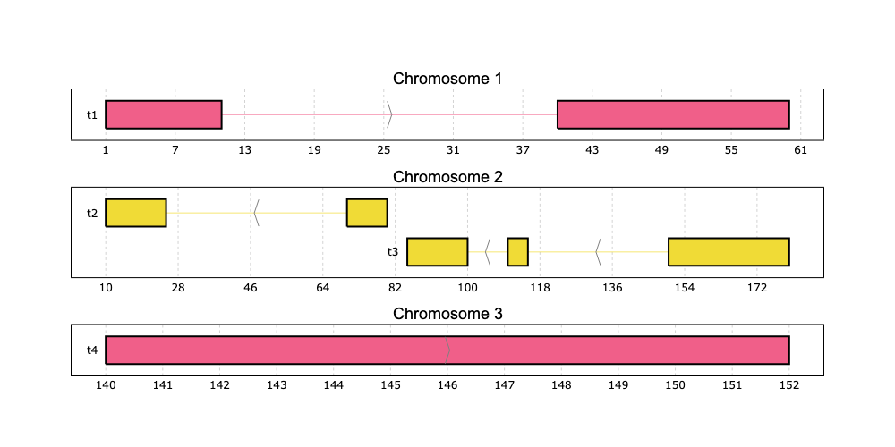

Use ``outline_col`` to map outlines from a column. When fill and outline columns use
different value domains, provide a channel mapping with separate ``"color"`` and
``"outline"`` entries:

    >>> pe.plot(
    ...     p,
    ...     color_col="Strand",
    ...     outline_col="feature1",
    ...     colormap={
    ...         "color": {"+": "skyblue", "-": "gold"},
    ...         "outline": {"a": "navy", "b": "black", "c": "purple", "d": "darkgreen"},
    ...     },
    ... )

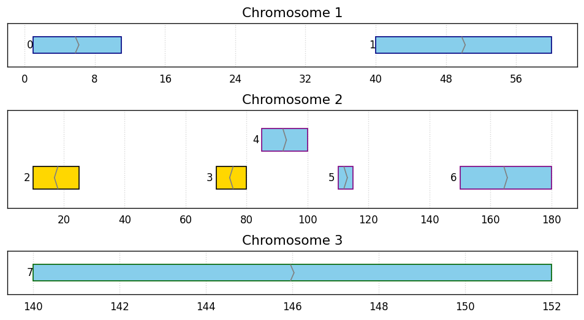

Numeric columns can be colored as a continuous gradient with ``type="quantitative"``.
Values are normalized to the observed minimum and maximum by default:

    >>> p["score"] = [0.1, 0.2, 0.4, 0.5, 0.55, 0.7, 0.9, 1.0]
    >>> pe.plot(p, color_col="score", colormap={"type": "quantitative", "colors": "viridis"})

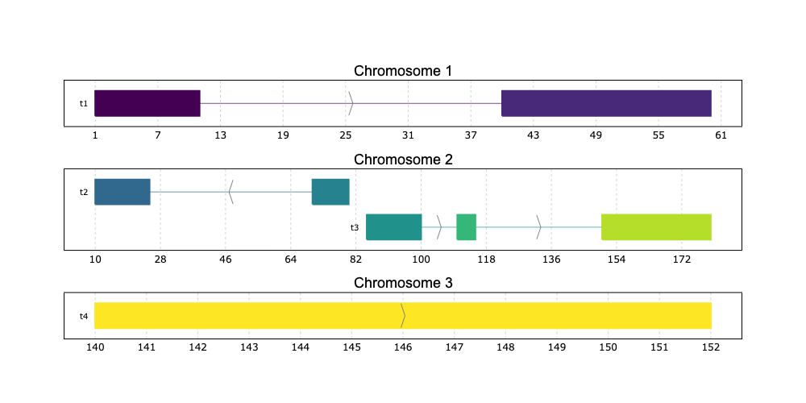

Set ``range=(min, max)`` to choose the normalization range manually. The gradient
can be a named continuous colormap, a list of colors, or normalized color stops:

    >>> pe.plot(
    ...     p,
    ...     color_col="score",
    ...     colormap={"type": "quantitative", "colors": ["blue", "white", "red"], "range": (0, 1)},
    ... )

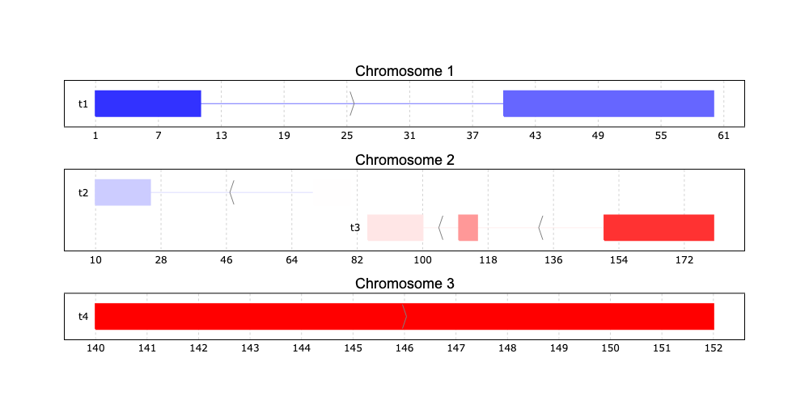

To improve the clarity of the plot, we can enable a legend that labels each color, making it easier 
to interpret the intervals based on their assigned colors. This can be done by setting the 
**legend** parameter of :func:`plot <pyrangeyes.plot>` as True:

    >>> pe.plot(p, colormap="Dark2", legend=True)

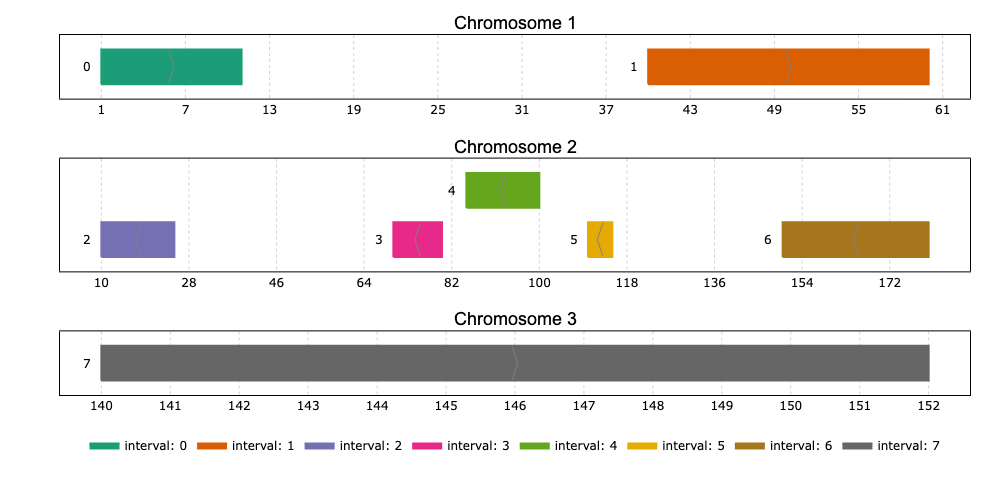

In this section, we have seen how to color intervals based on their attributes.
Next, we will see how to customize the appearance of the plot itself.

Text labels and annotations
---------------------------

Use ``text`` to place labels next to intervals. The value can be a column template,
including fixed text and column values in braces. Control placement with ``text_position``
and distance from intervals with ``text_pad``.

.. testcode::

    pe.plot(
        p,
        text="transcript: {transcript_id}",
        text_position="right",
        text_pad=2,
    )

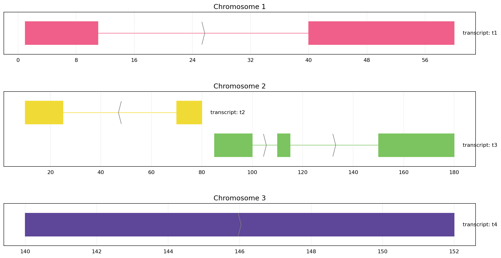

Text can also be styled independently from interval fill colors. Use a channel
``colormap`` to provide separate mappings for ``"color"`` and ``"text"``.

.. testcode::

    pe.plot(
        p,
        text="transcript: {transcript_id}",
        text_size=16,
        text_color_col="Strand",
        color_col="transcript_id",
        colormap={"color": "Dark2", "text": {"+": "black", "-": "crimson"}},
    )

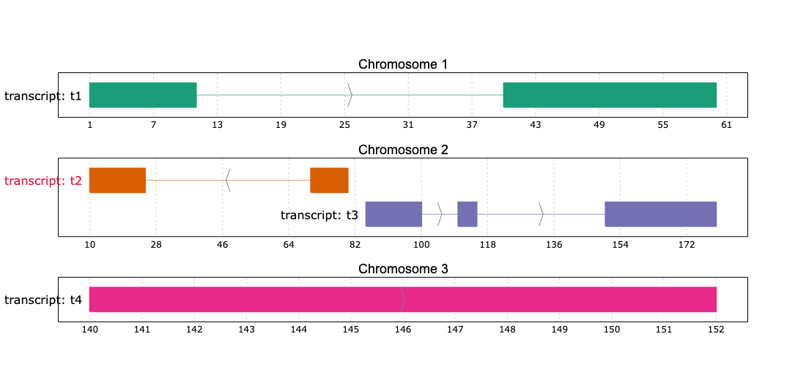

For a full list of text options, inspect ``pe.print_options()``.

Quick option reference
----------------------

A wide range of **options** are available to customize appearance, as summarized below:

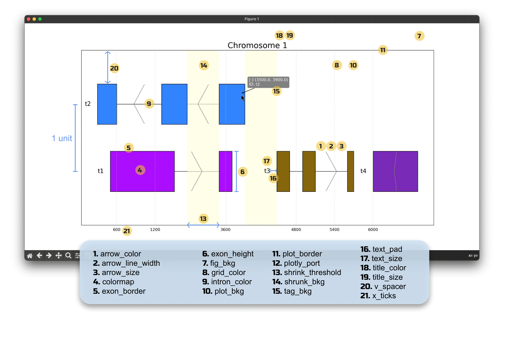

These options can be provided as parameters to the :func:`plot <pyrangeyes.plot>` function, or
set as default beforehand. Let's see an example of providing them as parameters:

    >>> pe.plot(p, plot_bkg="rgb(173, 216, 230)", plot_border="#808080", title_color="magenta")

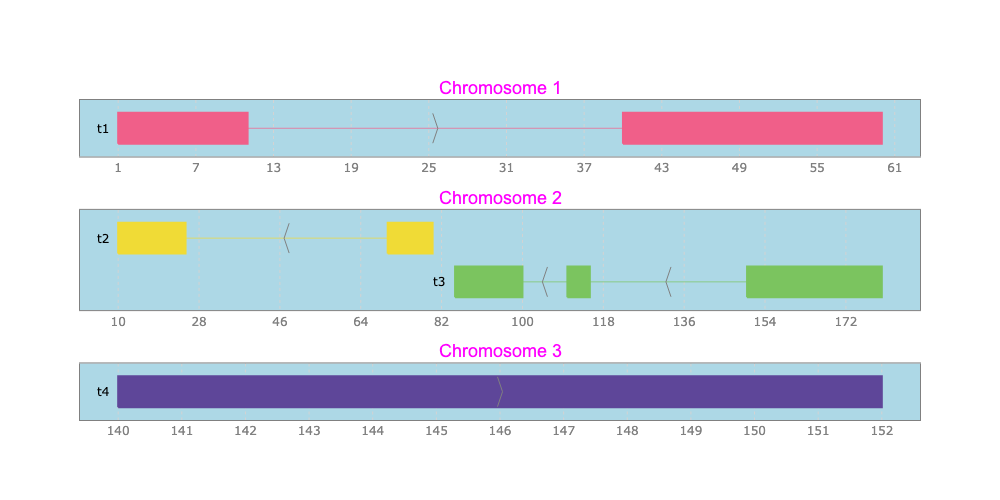

To instead set these options as default, use the :func:`set_options <pyrangeyes.set_options>` function:

    >>> pe.reset_options()
    >>> pe.set_options('plot_bkg', 'rgb(173, 216, 230)')
    >>> pe.set_options('plot_border', '#808080')
    >>> pe.set_options('title_color', 'magenta')
    >>> pe.plot(p)  # this will now open a plot identical to the previous one

To inspect the current default options, use the
:func:`print_options <pyrangeyes.print_options>` function.
Note that any modified values from the built-in defaults will be marked with an asterisk (*):

    >>> pe.print_options()
    +------------------+--------------------+---------+--------------------------------------------------------------+
    |     Feature      |       Value        | Edited? |                         Description                          |
    +------------------+--------------------+---------+--------------------------------------------------------------+
    |   arrow_color    |        grey        |         | Color of the arrow indicating strand.                        |
    | arrow_line_width |         1          |         | Line width of the arrow lines                                |
    |    arrow_size    |       0.006        |         | Float corresponding to the fraction of the plot or int       |
    |                  |                    |         | corresponding to the number of positions occupied by a       |
    |                  |                    |         | direction arrow.                                             |
    |     colormap     |       popart       |         | Colors to assign to interval fills. Use 'direct' when        |
    |                  |                    |         | color_col/outline_col/text_color_col already contain literal |
    |                  |                    |         | colors. A dict channel mapping must have 'color' and may     |
    |                  |                    |         | also have 'outline' and 'text'; 'color'/'outline' aliases    |
    |                  |                    |         | reuse channels. Values may be Matplotlib/Plotly colormap     |
    |                  |                    |         | names, color lists, value-to-color mappings, or quantitative |
    |                  |                    |         | specs.                                                       |
    |  outline_color   |      <infer>       |         | Fixed color for interval outlines. When None, outlines use   |
    |                  |                    |         | the resolved interval fill colors.                           |
    | interval_height  |        0.6         |         | Default (and maximum) height of rendered interval blocks.    |
    |     fig_bkg      |       white        |         | Bakground color of the whole figure.                         |
    |    grid_color    |     lightgrey      |         | Color of x coordinates grid lines.                           |
    |   intron_color   |      <infer>       |         | Color of the intron lines. When None, the color of the first |
    |                  |                    |         | interval will be used.                                       |
    |     plot_bkg     | rgb(173, 216, 230) |    *    | Background color of the plots.                               |
    |   plot_border    |      #808080       |    *    | Color of the line delimiting the plots.                      |
    |   plotly_port    |        8050        |         | Port to run plotly app.                                      |
    |   return_plot    |      <infer>       |         | Whether the plot is returned or not.                         |
    | shrink_threshold |        0.01        |         | Minimum length of an intron or intergenic region in order    |
    |                  |                    |         | for it to be shrunk while using the “shrink” feature. When   |
    |                  |                    |         | threshold is float, it represents the fraction of the plot   |
    |                  |                    |         | space, while an int threshold represents number of positions |
    |                  |                    |         | or base pairs.                                               |
    |    shrunk_bkg    |    lightyellow     |         | Color of the shrunk region background.                       |
    |     tag_bkg      |        grey        |         | Background color of the tooltip annotation for the gene in   |
    |                  |                    |         | Matplotlib.                                                  |
    |     text_pad     |         1          |         | Space, in percent of the visible plot span, between interval |
    |                  |                    |         | labels and intervals. For example, text_pad=1 means 1%.      |
    |    text_size     |         10         |         | Fontsize of the text annotation beside the intervals.        |
    |    text_color    |       black        |         | Fixed color of interval text annotations unless              |
    |                  |                    |         | text_color_col or colormap['text'] maps them.                |
    |    text_angle    |         0          |         | Rotation angle of interval text annotations, in degrees.     |
    |  text_position   |        left        |         | Position of interval text annotations: 'left', 'right',      |
    |                  |                    |         | 'center', 'above', or 'below'.                               |
    |     text_fit     |        True        |         | Whether text labels reserve space during packed layout to    |
    |                  |                    |         | reduce overlaps.                                             |
    |   title_color    |      magenta       |    *    | Color of the plots' titles.                                  |
    |    title_size    |         18         |         | Size of the plots' titles.                                   |
    |    title_font    |       Arial        |         | Font of the plots' titles.                                   |
    |     v_spacer     |        0.5         |         | Vertical distance between the intervals and plot border.     |
    |     x_ticks      |      <infer>       |         | Int, list or dict defining the x_ticks to be displayed. When |
    |                  |                    |         | int, number of ticks to be placed on each plot. When list,   |
    |                  |                    |         | it corresponds to de values used as ticks. When dict, the    |
    |                  |                    |         | keys must match the Chromosome values of the data, while the |
    |                  |                    |         | values can be either int or list of int; when int it         |
    |                  |                    |         | corresponds to the number of ticks to be placed; when list   |
    |                  |                    |         | of int it corresponds to de values used as ticks. Note that  |
    |                  |                    |         | when the tick falls within a shrunk region it will not be    |
    |                  |                    |         | diplayed.                                                    |
    +------------------+--------------------+---------+--------------------------------------------------------------+

To reset options to built-in defaults,  use :func:`reset_options <pyrangeyes.reset_options>`.
By default, it will reset all options. Providing arguments, you can select which options to reset:

    >>> pe.reset_options('plot_bkg')  # reset one feature
    >>> pe.reset_options(['plot_border', 'title_color'])  # reset a few features
    >>> pe.reset_options()  # reset all features

Built-in and custom themes
--------------------------

A pyrangeyes **theme** is a collection of options for appearance customization (those displayed above
with :func:`print_options <pyrangeyes.print_options>`) each with a set value.
Themes are implemented as dictionaries, that are passed to the :func:`set_theme <pyrangeyes.set_theme>` function.
In practice, setting a theme is equivalent to setting options like we did above
with :func:`set_options <pyrangeyes.set_options>`, but with a single command.

For example, below we create a theme corresponding to the appearance of our last plot:

    >>> my_theme = {
    ...     "plot_bkg": "rgb(173, 216, 230)",
    ...     "plot_border": "#808080",
    ...     "title_color": "magenta"
    ... }
    >>> pe.set_theme(my_theme)
    >>> pe.plot(p)  # this will now open a plot identical to the previous one

Pyrangeyes comes with a few built-in themes, listed in the :func:`set_theme <pyrangeyes.set_theme>` function's
documentation. For example, here's the "dark" theme:

    >>> pe.set_theme('dark')
    >>> pe.plot(p)

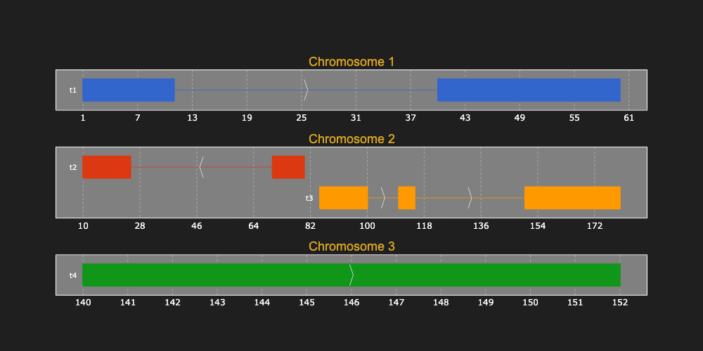

To reset the theme, you can resort again to :func:`reset_options <pyrangeyes.reset_options>`.

Managing space: packed/unpacked, shrink
---------------------------------------

By default, pyrangeyes tries to save as much vertical space as possible,
so the transcripts are placed one beside the other, in a "packed" disposition.
To instead display one transcript per row, set the ``packed`` parameter as ``False``:

.. testcode::

    pe.plot(p, packed=False)

When ``packed=False``, rows are shown in the first-seen order of the input by default.
This is useful when a PyRanges object was assembled by concatenating groups in a specific order,
or when the order of rows already carries meaning. To instead let pyrangeyes order groups by
its genomic sorting behavior, pass ``sort_ranges=True``:

.. testcode::

    pe.plot(p, packed=False, sort_ranges=True)

Pyrangeyes offers the option to reduce horizontal space, occupied by introns or intergenic regions,
by activating the ``shrink`` parameter.
The  ``shrink_threshold`` determines the minimum length of a region without visible intervals to be shrunk.
When a float is provided, it will be interpreted as a fraction of the visible coordinate limits,
while when an int is given it will be interpreted as number of base pairs.

    >>> ppp = pe.example_data.p3
    >>> print(ppp)  # doctest: +ELLIPSIS
    index    |    Chromosome    Strand    Start    End      transcript_id
    ...
    PyRanges with 20 rows, 5 columns, and 1 index columns.
    Contains 2 chromosomes and 2 strands.

.. testcode::

    pe.plot(ppp, shrink=True)

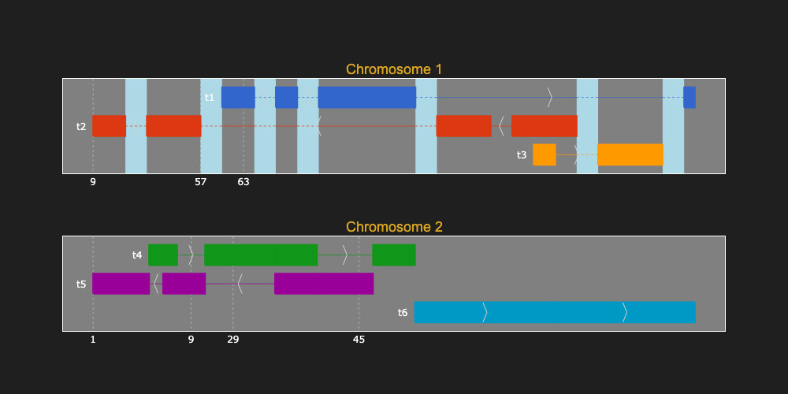

.. testcode::

    pe.plot(ppp, shrink=True, shrink_threshold=0.2)

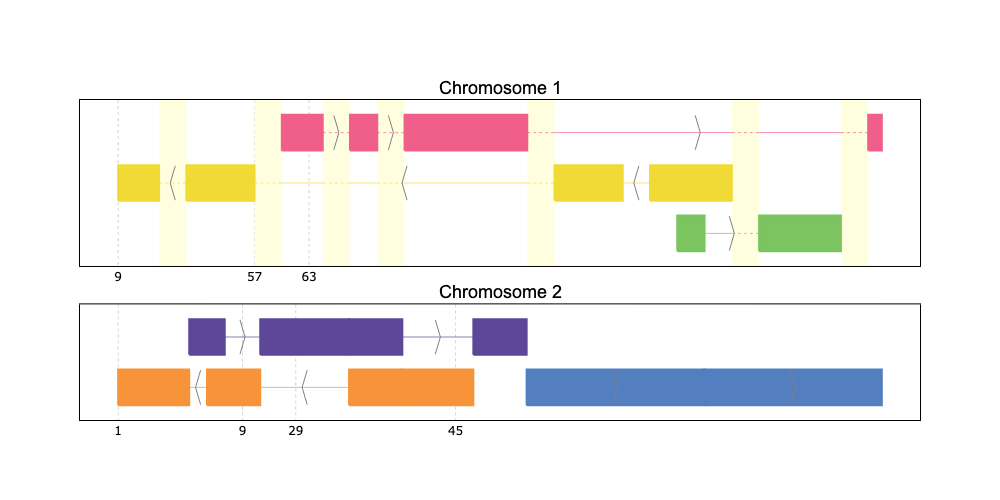

Displaying multiple tracks
--------------------------

Pass a list of PyRanges objects to display them as separate tracks.
Use different IDs when tracks should get different default colors.

.. testcode::

    enhancers = pr.PyRanges(
        {
            "Chromosome": ["chr1", "chr1", "chr1"],
            "Start": [15, 95, 175],
            "End": [45, 130, 215],
            "id": ["enh1", "enh2", "enh3"],
        }
    )
    promoters = pr.PyRanges(
        {
            "Chromosome": ["chr1", "chr1", "chr1"],
            "Start": [55, 145, 240],
            "End": [80, 165, 270],
            "id": ["prom1", "prom2", "prom3"],
        }
    )
    pe.plot([enhancers, promoters], id_col="id")

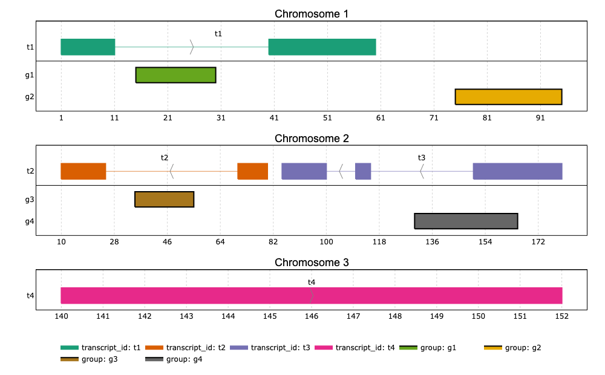

The same pattern works with more tracks. Use ``track_labels`` to name them on the y-axis:

.. testcode::

    insulators = pr.PyRanges(
        {
            "Chromosome": ["chr1", "chr1"],
            "Start": [25, 225],
            "End": [35, 235],
            "id": ["ins1", "ins2"],
        }
    )
    pe.plot(
        [enhancers, promoters, insulators],
        id_col="id",
        track_labels=["Enhancers", "Promoters", "Insulators"],
    )

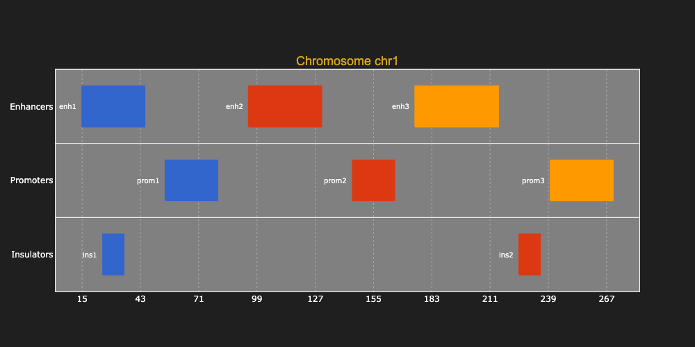

mRNA, SNPs, and other adapter views
-----------------------------------

Adapters are shortcuts to useful representations. They prepare domain-specific
inputs with sensible defaults before plotting.

The ``mRNA`` adapter shows CDS regions thicker than UTR/exon regions. Here,
``tx1`` and ``tx2`` are coding transcripts, while ``lnc1`` is exon-only:

.. testcode::

    mrna = pr.PyRanges(
        {
            "Chromosome": ["chr1"] * 14,
            "Strand": ["+"] * 14,
            "Feature": ["exon", "CDS", "exon", "CDS", "exon", "CDS", "exon", "CDS", "exon", "CDS", "exon", "CDS", "exon", "exon"],
            "Start": [10, 25, 80, 80, 140, 140, 210, 225, 275, 275, 340, 340, 430, 470],
            "End": [55, 55, 120, 120, 190, 175, 255, 255, 315, 315, 390, 365, 455, 500],
            "transcript_id": ["tx1", "tx1", "tx1", "tx1", "tx1", "tx1", "tx2", "tx2", "tx2", "tx2", "tx2", "tx2", "lnc1", "lnc1"],
        }
    )
    pe.plot(mrna, "mRNA")

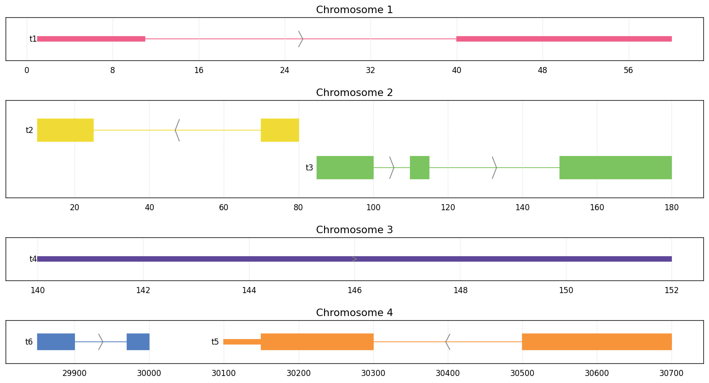

The ``SNP`` adapter draws fixed-size markers for single-position variants:

.. testcode::

    snps = pr.PyRanges(
        {
            "Chromosome": ["chr1", "chr1", "chr1", "chr1", "chr1"],
            "Start": [35, 105, 165, 235, 355],
            "End": [36, 106, 166, 236, 356],
            "ID": ["rs1", "rs2", "rs3", "rs4", "rs5"],
            "REF": ["A", "G", "C", "T", "A"],
            "ALT": ["T", "A", "G", "C", "G"],
        }
    )
    pe.plot(snps, "SNP", color_col="ALT", shape="diamond")

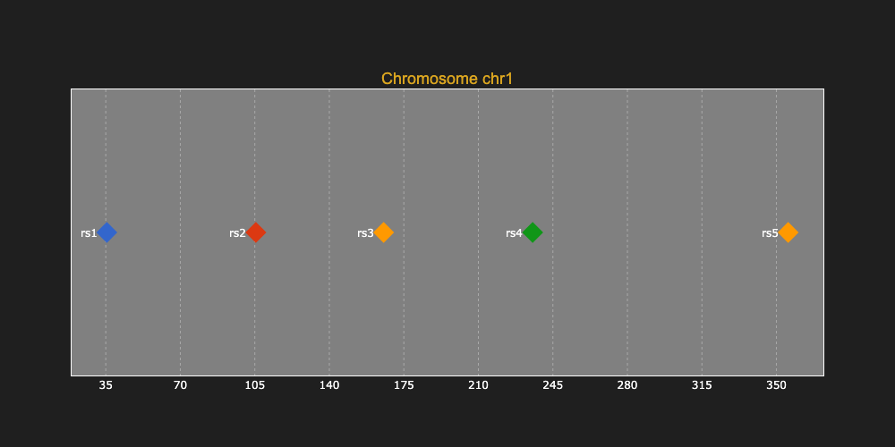

Adapters can be combined across tracks:

.. testcode::

    pe.plot([mrna, snps], adapter=["mRNA", "SNP"], shape="triangle-up")

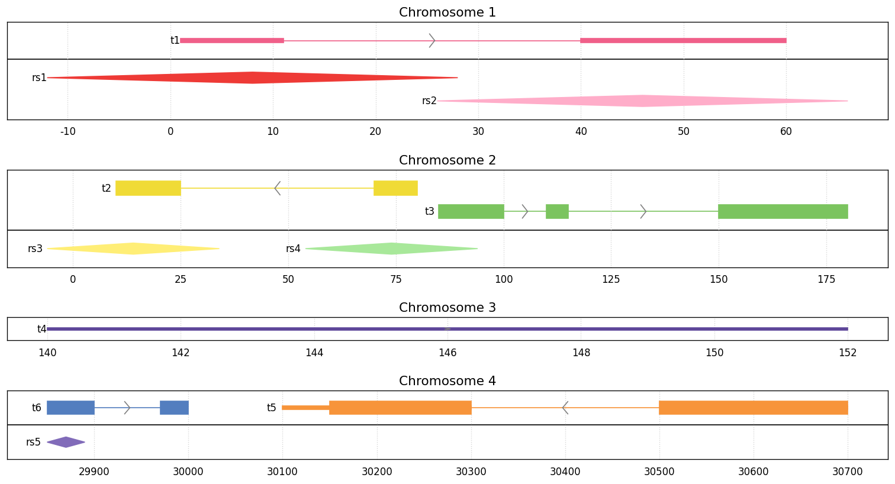

List all available adapters with ``pe.adapters.describe()`` and inspect adapter
options with ``pe.print_options(adapter="mRNA")``.

Tooltips and panel titles
-------------------------

In interactive plots, hover over intervals to see their coordinates, strand, and ID.
Add columns with ``tooltip`` templates, and customize panel titles with ``title_chr``:

.. testcode::

    pe.plot(
        p,
        tooltip="first feature: {feature1}\nsecond feature: {feature2}",
        title_chr="Chr: {chrom}",
    )

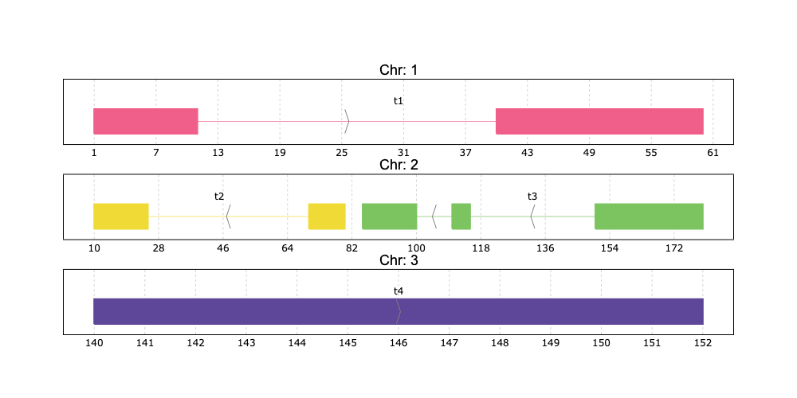

Adding aligned plots
--------------------

Use ``add_aligned_plots`` to add Plotly traces aligned to the genomic x-axis.
Here an mRNA track and SNP track are shown with a scatter plot of SNP scores.
See :func:`make_scatter() <pyrangeyes.make_scatter>` for scatter helper options.

.. testcode::

    snps1 = pr.PyRanges(
        {
            "Chromosome": ["chr1", "chr1", "chr1"],
            "Start": [35, 105, 235],
            "End": [36, 106, 236],
            "ID": ["rs1", "rs2", "rs3"],
            "ALT": ["T", "A", "G"],
            "score": [0.2, 0.8, 0.5],
        }
    )
    aligned = pe.make_scatter(snps1, y="score", title="SNP score", engine="ply")
    pe.plot([mrna, snps1], adapter=["mRNA", "SNP"], add_aligned_plots=[aligned])

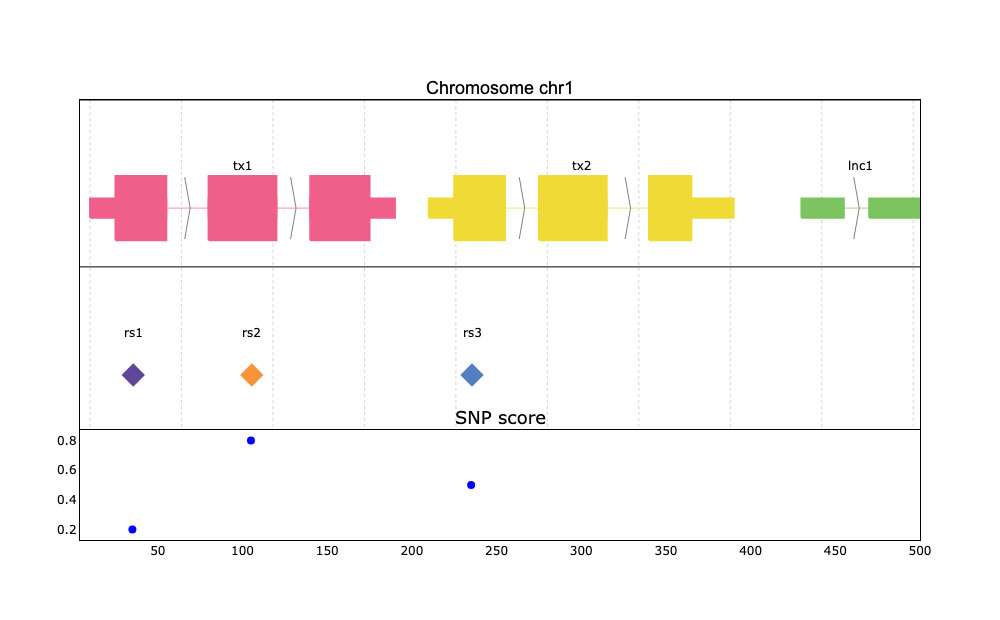

Integrating Pyrangeyes with External Visualizations
---------------------------------------------------

For custom dashboards, return the Plotly/Dash object with ``return_plot="app"``
and compose it with other Dash components.

.. testcode::

    from dash import dcc, html
    import plotly.graph_objects as go

    app = pe.plot([mrna, snps1], adapter=["mRNA", "SNP"], return_plot="app")
    pie = go.Figure(go.Pie(labels=["A", "T", "G"], values=[1, 1, 1]))

    app.layout = html.Div([app.layout, dcc.Graph(figure=pie)])

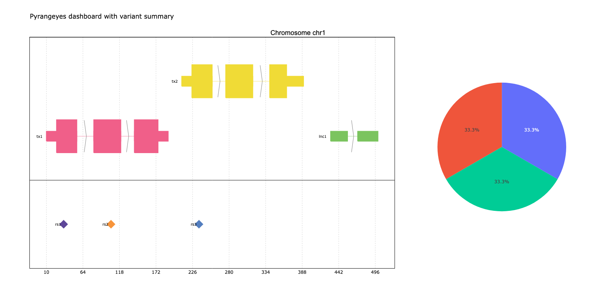
