.. _tutorial:

Tutorial
~~~~~~~~

This tutorial assumes some familiarity with pyranges v1.
If necessary, go through its tutorial first: https://pyranges1.readthedocs.io/

.. contents:: Contents of Tutorial
   :depth: 3

Getting started
---------------

First choose a plotting **engine** with :func:`set_engine <pyrangeyes.set_engine>`.
Optionally call :func:`register_methods <pyrangeyes.register_methods>` to add pyrangeyes
convenience methods to PyRanges objects, such as ``.plot(...)`` and ``.track(...)``.

    >>> import pyranges1 as pr
    >>> import pyrangeyes as pe
    >>> pe.set_engine("plotly")  # possible engines: "plotly" and "matplotlib"
    >>> pe.register_methods()

Pyrangeyes centralizes the interface to producing graphics in
the :func:`plot <pyrangeyes.plot>` function. It offers plenty of options to
customize the appearance of the plot, showcased in this tutorial.
To that end, we will use some example data included in the Pyrangeyes package.
Yet, any PyRanges object can be used, e.g. loaded from gff, gtf, bam files.

    >>> x = pe.example_data.p1
    >>> x  # doctest: +ELLIPSIS
      index  |      Chromosome  Strand      Start      End  transcript_id    feature1    ...
    ...
          0  |               1  +               1       11  t1               a           ...
          1  |               1  +              40       60  t1               a           ...
          2  |               2  -              10       25  t2               b           ...
          3  |               2  -              70       80  t2               b           ...
          4  |               2  -              85      100  t3               c           ...
          5  |               2  -             110      115  t3               c           ...
          6  |               2  -             150      180  t3               c           ...
          7  |               3  +             140      152  t4               d           ...
    PyRanges with 8 rows, 7 columns, and 1 index columns...

By default, :func:`plot <pyrangeyes.plot>` produces an interactive plot. If the Matplotlib engine is selected,
a window appears. If the Plotly engine is selected, a server is automatically opened, and
an address is printed in the console. The plot can be accessed by opening this address in a browser.

    >>> pe.plot(x)

*Matplotlib engine*

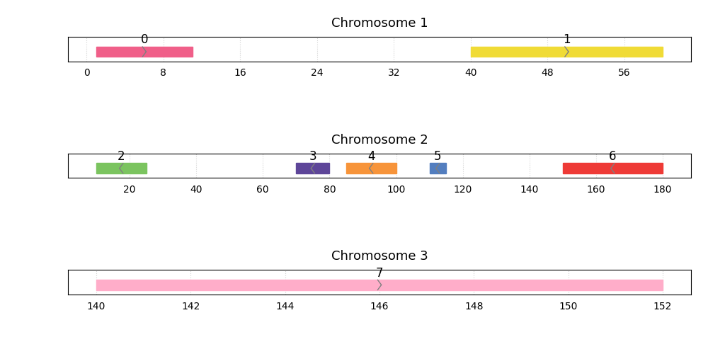

*Figure size: 1120 × 535 px (11.20 × 5.35 in).*
Interactive navigation is intuitive:

* Hover over intervals to see their details in a **tooltip**
* Click and drag to zoom in on a region.
* Double-click to reset the zoom level.
* Inspect the rest of buttons on the top-right to see other available actions.

To create a pdf or png image file instead of opening an interactive plot,
use the ``to_file`` parameter of :func:`plot <pyrangeyes.plot>`.

    >>> pe.plot(x, to_file="my_plot.png")

When no explicit size is provided, pyrangeyes now infers the figure height automatically from the number of panels and stacked interval rows. Auto sizing changes height only; width stays fixed unless an explicit ``(width, height)`` export size is provided. The global option ``auto_height_px_per_unit`` controls the pixel length assigned to one vertical layout unit:

    >>> pe.set_options("auto_height_px_per_unit", 52)

Pass ``to_file=("my_plot.png", (width, height))`` when you need to override the inferred canvas size for a specific export.

Because we called ``register_methods()``, PyRanges objects now have a ``.plot(...)`` method.
This is equivalent to the last code block:

    >>> x.plot(to_file="my_plot.png")

In the figure above, intervals are displayed individually, i.e. each PyRanges row is treated as a separate entity.
To link the intervals instead, as to represent a transcript composed of exons, use the ``id_column`` parameter,
indicating the column name that defines the groups of intervals.

    >>> pe.plot(x, id_col="transcript_id")

*Matplotlib engine*

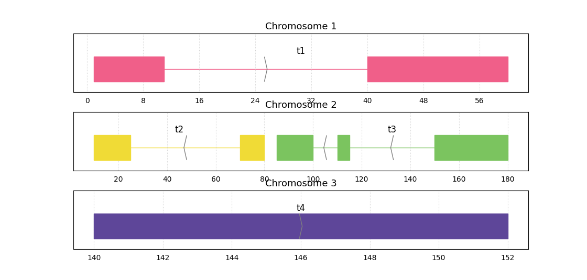

*Figure size: 1120 × 535 px (11.20 × 5.35 in).*
Because the ``id_col`` parameter is used frequently, it can be set as default for all plots using function
:func:`set_id_col <pyrangeyes.set_id_col>`. The following code is equivalent to the previous one:

    >>> pe.set_id_col("transcript_id")
    >>> pe.plot(x)

Selecting what to plot
----------------------
To plot only a subset of the data, use the Pandas/PyRanges object's slicing capabilities.
For example, this plots the intervals on chromosome 2, negative strand, between positions 100 and 200:

    >>> (x.loci[2, '-', 100:200]).plot()

By default, the **limits of plot coordinates** are set to show all the data, and leave some margin at the edges.
This is customizable with the ``limits`` parameter.
The user can decide to change all or some of the coordinate limits leaving the rest as default if desired.
The ``limits`` parameter accepts different input types:

* Dictionary with chromosome names as keys, and a tuple of two integer numbers indicating the limits.
  Either coordinate can be ``None`` to leave that side as default.

* Tuple of two integer numbers, which sets the same limits for all plotted chromosomes.

* PyRanges object, wherein Start and End columns define the limits for the corresponding Chromosome.

    >>> pe.plot(x, limits={1: (None, 100), 2: (60, 200)})

*Matplotlib engine*

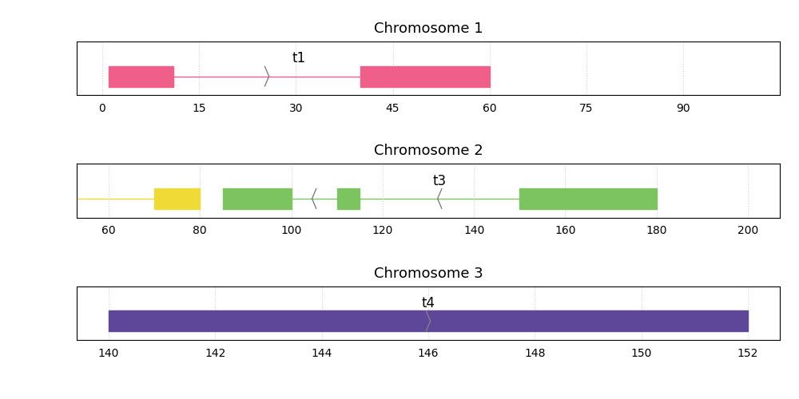

*Figure size: 1120 × 535 px (11.20 × 5.35 in).*
To plot with specified limits, use the following code:

    >>> pe.plot(x, limits=(0,300))

*Matplotlib engine*

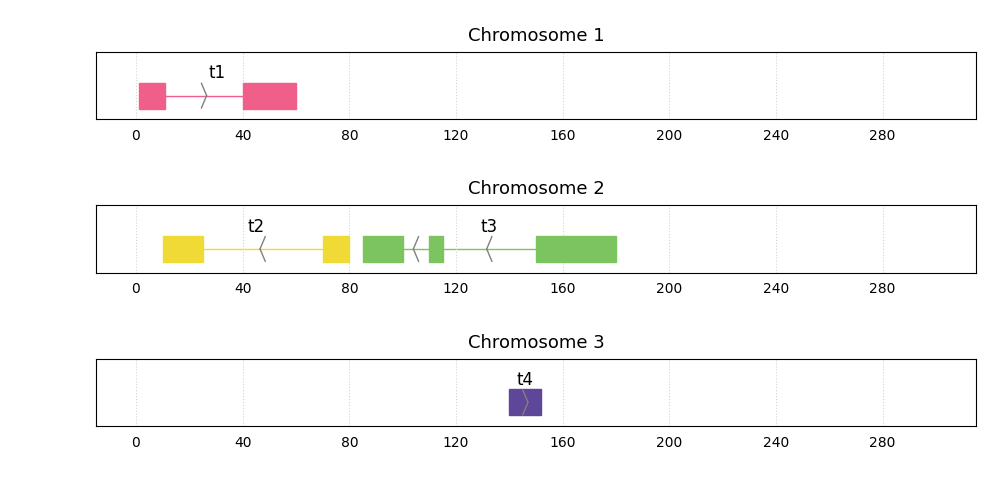

*Figure size: 1120 × 535 px (11.20 × 5.35 in).*
Defining regions for panels
----------------------------

Use ``regions`` to replace the default one-panel-per-chromosome layout with specific panels.
For example, this makes one panel per transcript by using a column name:

    >>> pe.plot(x, regions="transcript_id", fill_col="transcript_id", label=False)

*Matplotlib engine*

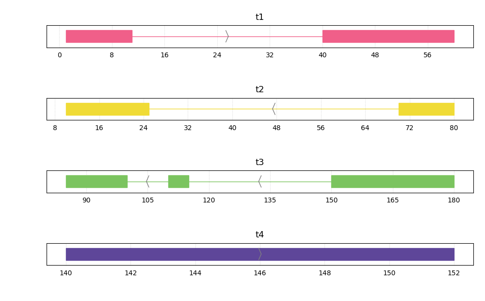

*Figure size: 1120 × 573 px (11.20 × 5.73 in).*
Explicit regions are also supported with ``(chromosome, start, end)`` tuples or PyRanges rows:

    >>> pe.plot(x, regions=[(2, 60, 120), (2, 140, 190), (1, None, None)])

*Matplotlib engine*

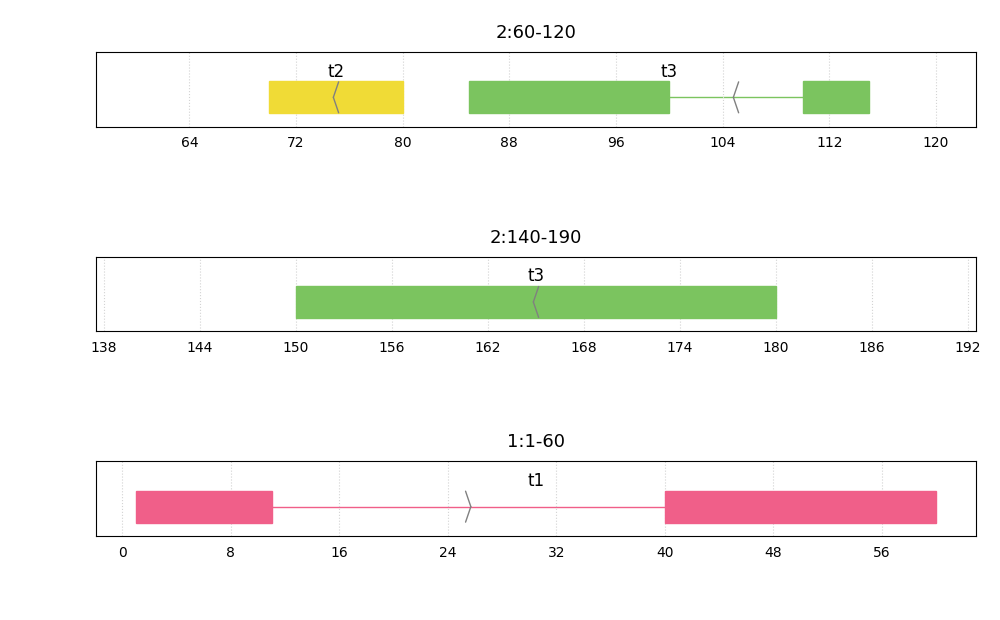

*Figure size: 1120 × 535 px (11.20 × 5.35 in).*
Plotting intervals in strand direction
--------------------------------------

Use ``reverse="auto"`` to mirror panels whose known intervals are all on the negative strand.
In ``x``, all intervals on chromosome 2 are negative-strand, so that panel is reversed automatically.
Note the decreasing X axis.

    >>> pe.plot(x, reverse="auto")

*Matplotlib engine*

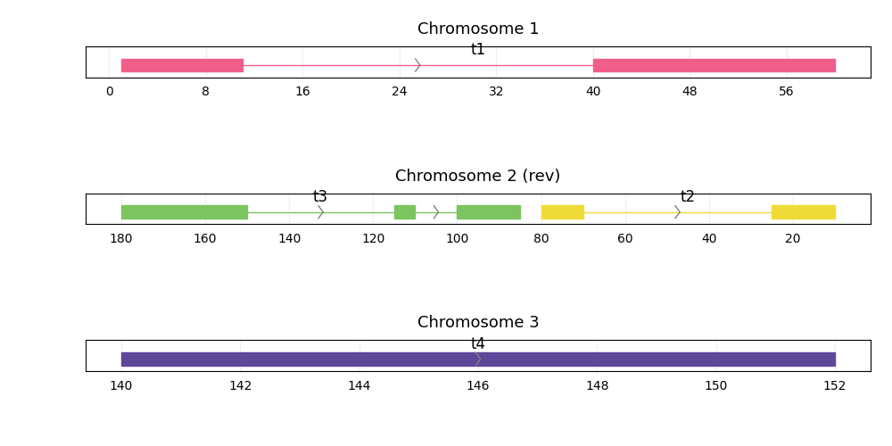

*Figure size: 1120 × 535 px (11.20 × 5.35 in).*
``reverse`` also accepts explicit inputs such as ``True``, a list of chromosomes, or a ``{chrom: bool}`` mapping.

Coloring
--------
By default, the intervals are **colored** according to the ID column
(``transcript_id`` in this case,  previously set as default with :func:`set_id_col <pyrangeyes.set_id_col>`).

We can select any other column to color the intervals by using the ``fill_col`` parameter
of :func:`plot <pyrangeyes.plot>`.
For example, let's color by the Strand column:

    >>> pe.plot(x, fill_col="Strand")

*Matplotlib engine*

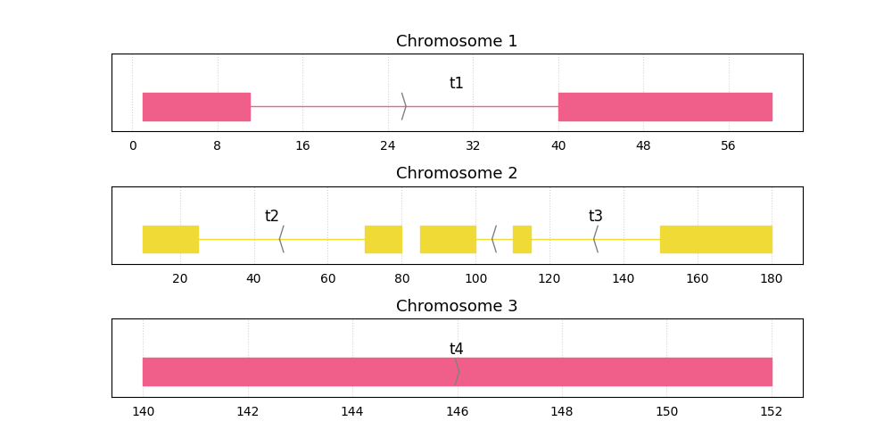

*Figure size: 1120 × 535 px (11.20 × 5.35 in).*
Now the "+" strand transcripts are displayed in one color and the ones on the "-" strand in another color.
Note that pyrangeyes used its default color scheme, and mapped each value in the  ``fill_col`` column to a color.

The  **colormap** parameter of :func:`plot <pyrangeyes.plot>` centralizes coloring customization.
It is a versatile parameter, accepting many different types of input. Colors can be hex strings,
rgb strings, or explicit color names such as ``"skyblue"`` and ``"black"``.
Using a dictionary allows to exert full control over the coloring, explicitly setting each value-color pair:

    >>> pe.plot(x, fill_col="Strand",
    ...          colormap={"+": "green", "-": "red"})

*Matplotlib engine*

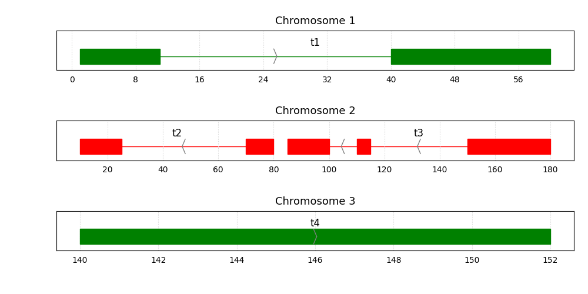

*Figure size: 1120 × 535 px (11.20 × 5.35 in).*
Alternatively, the user may just define the sequence of colors used
(letting pyrangeyes pick which color to assign to each value).
One can provide a list of colors in hex or rgb; or a string recognized as the name of an available
Matplotlib or Plotly colormap;
or an actual Matplotlib or Plotly colormap object. Below, we invoke the "Dark2" Matplotlib colormap:

    >>> pe.plot(x, colormap="Dark2")

*Matplotlib engine*

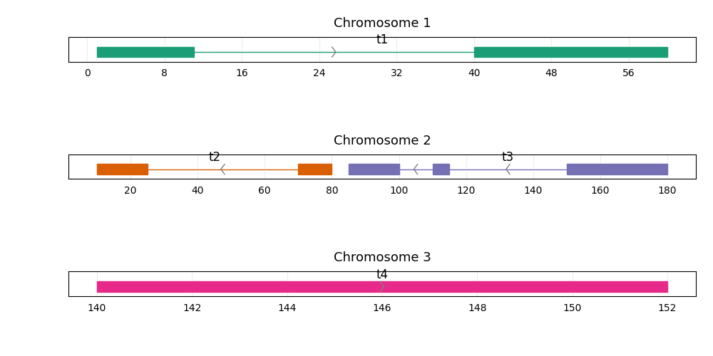

*Figure size: 1120 × 535 px (11.20 × 5.35 in).*
If a column already stores literal colors (for example hex strings), set ``colormap="direct"``
to use those values directly instead of mapping them as categories:

    >>> x["fill"] = ["#8ecae6", "#8ecae6", "#ffb703", "#ffb703", "#219ebc", "#219ebc", "#219ebc", "#fb8500"]
    >>> pe.plot(x, fill_col="fill", colormap="direct")

*Matplotlib engine*

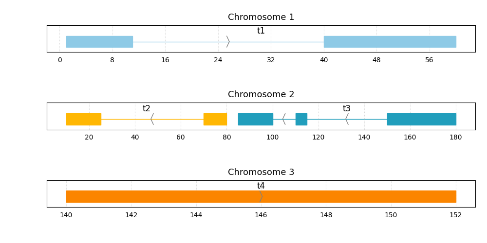

*Figure size: 1120 × 535 px (11.20 × 5.35 in).*
Enable ``legend=True`` to label the colors used in the plot. Also, by default,
interval outlines use the same resolved color as the fill. For one fixed outline
color, use the ``outline_color`` option:

    >>> pe.plot(x, fill_col="Strand", outline_color="black", legend=True)

*Matplotlib engine*

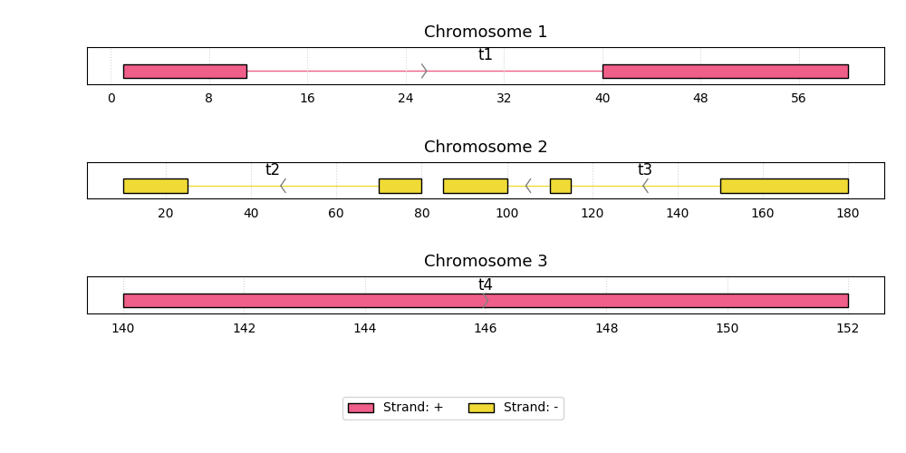

*Figure size: 1120 × 568 px (11.20 × 5.68 in).*
Use ``outline_col`` to map outlines from a column. When fill and outline columns use
different value domains, provide a channel mapping with separate ``"fill"`` and
``"outline"`` entries:

    >>> pe.plot(
    ...     x,
    ...     fill_col="fill",
    ...     outline_col="feature1",
    ...     colormap={
    ...         "fill": "direct",
    ...         "outline": {"a": "navy", "b": "black", "c": "purple", "d": "darkgreen"},
    ...     },
    ... )

*Matplotlib engine*

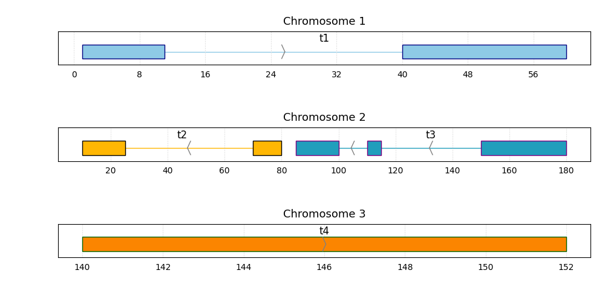

*Figure size: 1120 × 535 px (11.20 × 5.35 in).*
Numeric columns can be colored as a continuous gradient with ``type="quantitative"``.
Values are normalized to the observed minimum and maximum by default:

    >>> x["Score"] = [0.1, 0.2, 0.4, 0.5, 0.55, 0.7, 0.9, 1.0]
    >>> pe.plot(x, fill_col="Score", colormap={"type": "quantitative", "colors": "viridis"}, legend=True)

*Matplotlib engine*

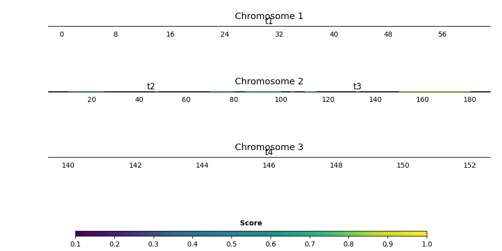

*Figure size: 1120 × 568 px (11.20 × 5.68 in).*
Set ``range=(min, max)`` to choose the normalization range manually. The gradient
can be a named continuous colormap, a list of colors, or normalized color stops:

    >>> pe.plot(
    ...     x,
    ...     fill_col="Score",
    ...     colormap={"type": "quantitative", "colors": ["blue", "white", "red"], "range": (0, 1)},
    ...     legend=True,
    ... )

*Matplotlib engine*

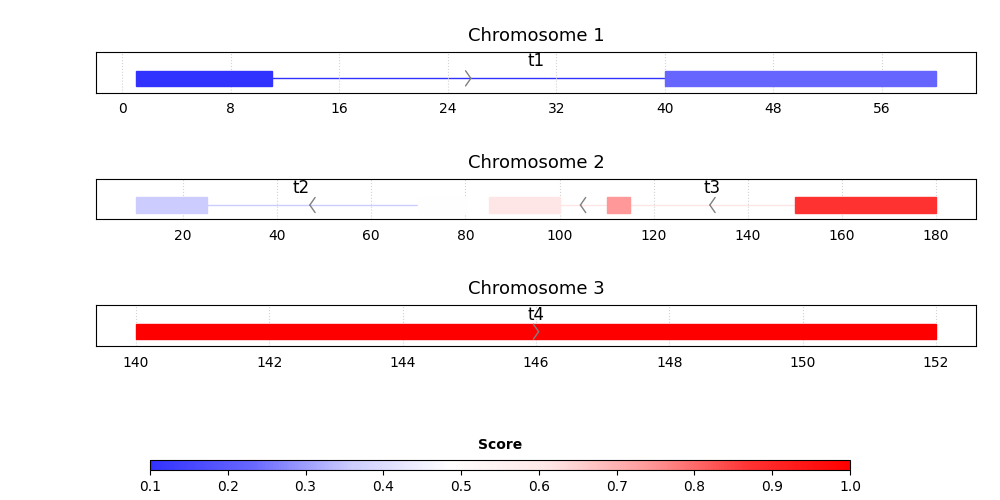

*Figure size: 1120 × 568 px (11.20 × 5.68 in).*
Text labels and annotations
---------------------------

Use ``label`` to place labels next to intervals. The value can be a column template,
including fixed text and column values in braces. Control placement with ``label_position``
and distance from intervals with ``label_pad``.

    >>> pe.plot(
    ...     x,
    ...     label="transcript: {transcript_id}",
    ...     label_position="right",
    ...     label_pad=2,
    ... )

*Matplotlib engine*

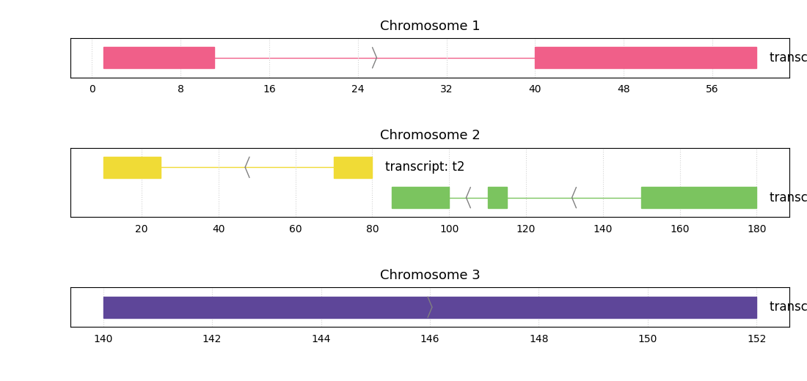

*Figure size: 1120 × 528 px (11.20 × 5.28 in).*
Labels can also be styled independently from interval fill colors. Use a channel
``colormap`` to provide separate mappings for ``"fill"`` and ``"label"``.

    >>> pe.plot(
    ...     x,
    ...     label="transcript: {transcript_id}",
    ...     label_size=16,
    ...     label_color_col="Strand",
    ...     fill_col="transcript_id",
    ...     colormap={"fill": "Dark2", "label": {"+": "black", "-": "crimson"}},
    ... )

*Matplotlib engine*

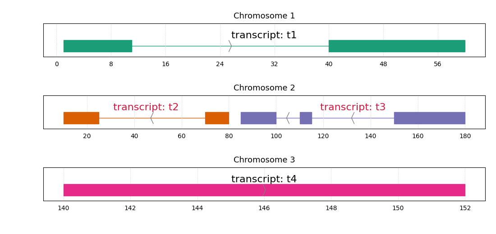

*Figure size: 1120 × 573 px (11.20 × 5.73 in).*
Quick option reference
----------------------

Reset options before inspecting the built-in defaults:

    >>> pe.reset_options()

Use :func:`print_options <pyrangeyes.print_options>` to inspect the current global plot options.
The table shows each option name, its current value, whether it differs from the built-in default,
and a short description.

    >>> pe.print_options()
    +-------------------------+-------------+---------+--------------------------------------------------------------+
    |         Feature         |    Value    | Edited? |                         Description                          |
    +-------------------------+-------------+---------+--------------------------------------------------------------+
    | ======================================== General and plot appearance ========================================= |
    |        figure_bg        |    white    |         | Bakground color of the whole figure.                         |
    |       plot_border       |    black    |         | Color of the line delimiting the plots.                      |
    |       plotly_port       |    8050     |         | Port to run plotly app.                                      |
    |       return_plot       |   <infer>   |         | Whether the plot is returned or not.                         |
    | ============================================== Panels and axes =============================================== |
    |       grid_color        |  lightgrey  |         | Color of x coordinates grid lines.                           |
    |        shrunk_bg        | lightyellow |         | Color of the shrunk region background.                       |
    |    shrink_threshold     |    0.01     |         | Minimum length of an intron or intergenic region in order    |
    |                         |             |         | for it to be shrunk while using the “shrink” feature. When   |
    |                         |             |         | threshold is float, it represents the fraction of the plot   |
    |                         |             |         | space, while an int threshold represents number of positions |
    |                         |             |         | or base pairs.                                               |
    |        v_spacer         |    0.25     |         | Vertical distance between the intervals and plot border.     |
    |         x_ticks         |   <infer>   |         | Int, list or dict defining the x_ticks to be displayed. When |
    |                         |             |         | int, number of ticks to be placed on each plot. When list,   |
    |                         |             |         | it corresponds to de values used as ticks. When dict, the    |
    |                         |             |         | keys must match the Chromosome values of the data, while the |
    |                         |             |         | values can be either int or list of int; when int it         |
    |                         |             |         | corresponds to the number of ticks to be placed; when list   |
    |                         |             |         | of int it corresponds to de values used as ticks. Note that  |
    |                         |             |         | when the tick falls within a shrunk region it will not be    |
    |                         |             |         | diplayed.                                                    |
    | auto_height_px_per_unit |     80      |         | Pixels assigned to one vertical layout unit when pyrangeyes  |
    |                         |             |         | infers figure height automatically.                          |
    |       title_color       |    black    |         | Color of panel titles.                                       |
    |       title_size        |     18      |         | Font size of panel titles.                                   |
    |       title_font        |    Arial    |         | Font family of panel titles.                                 |
    | ======================================= Tracks and interval appearance ======================================= |
    |        track_bg         |    white    |         | Background color of the plots.                               |
    |     interval_height     |     0.6     |         | Default (and maximum) height of rendered interval blocks.    |
    |      squish_factor      |     0.3     |         | Factor applied to rendered interval height and stacked-row   |
    |                         |             |         | spacing for tracks with squish=True.                         |
    |        colormap         |   popart    |         | Colors to assign to interval fills. Use 'direct' when        |
    |                         |             |         | fill_col/outline_col/label_color_col already contain literal |
    |                         |             |         | colors. A dict channel mapping must have 'fill' and may also |
    |                         |             |         | have 'outline' and 'label'; 'fill'/'outline' aliases reuse   |
    |                         |             |         | channels. Values may be Matplotlib/Plotly colormap names,    |
    |                         |             |         | color lists, value-to-color mappings, or quantitative specs. |
    |      outline_color      |   <infer>   |         | Fixed color for interval outlines. When None, outlines use   |
    |                         |             |         | the resolved interval fill colors.                           |
    |      intron_color       |   <infer>   |         | Color of the intron lines. When None, the color of the first |
    |                         |             |         | interval will be used.                                       |
    |       arrow_color       |    grey     |         | Color of the arrow indicating strand.                        |
    |    arrow_line_width     |      1      |         | Line width of the arrow lines                                |
    |       arrow_size        |    0.006    |         | Float corresponding to the fraction of the plot or int       |
    |                         |             |         | corresponding to the number of positions occupied by a       |
    |                         |             |         | direction arrow.                                             |
    | =========================================== Text options per-track =========================================== |
    |        label_pad        |      1      |         | Space, in percent of the visible plot span, between interval |
    |                         |             |         | labels and intervals. For example, label_pad=1 means 1%.     |
    |       label_size        |     12      |         | Fontsize of the text annotation beside the intervals.        |
    |       label_color       |    black    |         | Fixed color of interval labels unless label_color_col or     |
    |                         |             |         | colormap['label'] maps them.                                 |
    |       label_angle       |      0      |         | Rotation angle of interval labels, in degrees.               |
    |     label_position      |    above    |         | Position of interval labels: 'left', 'right', 'center',      |
    |                         |             |         | 'top'/'above', or 'bottom'/'below'.                          |
    |        label_fit        |    True     |         | Whether text labels reserve space during pack layout to      |
    |                         |             |         | reduce overlaps.                                             |
    |         tag_bkg         |    grey     |         | Background color of the tooltip annotation for the gene in   |
    |                         |             |         | Matplotlib.                                                  |
    +-------------------------+-------------+---------+--------------------------------------------------------------+

Any listed option can be provided directly to :func:`plot <pyrangeyes.plot>` for a single figure:

    >>> pe.plot(x, track_bg="rgb(173, 216, 230)", plot_border="#808080", title_color="magenta")

*Matplotlib engine*

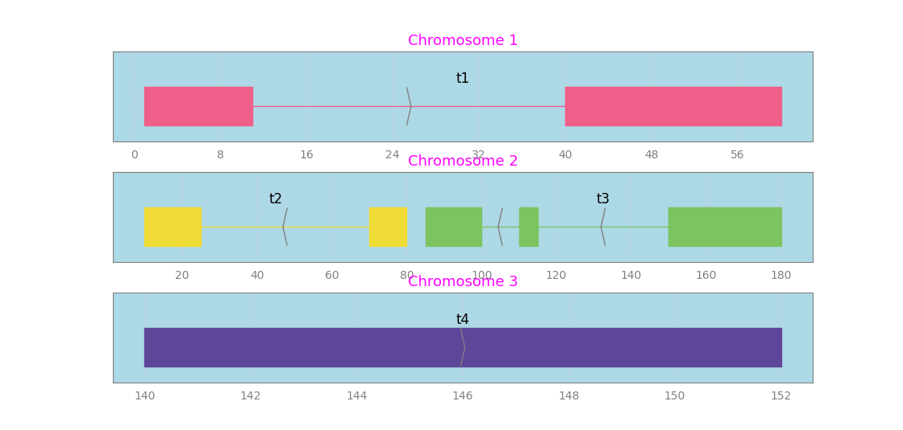

*Figure size: 1120 × 535 px (11.20 × 5.35 in).*
To set options as defaults for later plots, use :func:`set_options <pyrangeyes.set_options>`:

    >>> pe.reset_options()
    >>> pe.set_options('track_bg', 'rgb(173, 216, 230)')
    >>> pe.set_options('plot_border', '#808080')
    >>> pe.set_options('title_color', 'magenta')
    >>> pe.plot(x)  # this will now open a plot identical to the previous one

To reset options to built-in defaults, use :func:`reset_options <pyrangeyes.reset_options>`.
By default, it will reset all options. Providing arguments, you can select which options to reset:

    >>> pe.reset_options('track_bg')  # reset one feature
    >>> pe.reset_options(['plot_border', 'title_color'])  # reset a few features
    >>> pe.reset_options()  # reset all features

Built-in and custom themes
--------------------------

A pyrangeyes **theme** is a collection of options for appearance customization (those displayed above
with :func:`print_options <pyrangeyes.print_options>`) each with a set value.
Themes are implemented as dictionaries, that are passed to the :func:`set_theme <pyrangeyes.set_theme>` function.
In practice, setting a theme is equivalent to setting options like we did above
with :func:`set_options <pyrangeyes.set_options>`, but with a single command.

For example, below we create a theme corresponding to the appearance of our last plot:

    >>> my_theme = {
    ...     "track_bg": "rgb(173, 216, 230)",
    ...     "plot_border": "#808080",
    ...     "title_color": "magenta"
    ... }
    >>> pe.set_theme(my_theme)
    >>> pe.plot(x)  # this will now open a plot identical to the previous one

Pyrangeyes comes with a few built-in themes, listed in the :func:`set_theme <pyrangeyes.set_theme>` function's
documentation. For example, here's the "dark" theme:

    >>> pe.set_theme('dark')
    >>> pe.plot(x)

*Matplotlib engine*

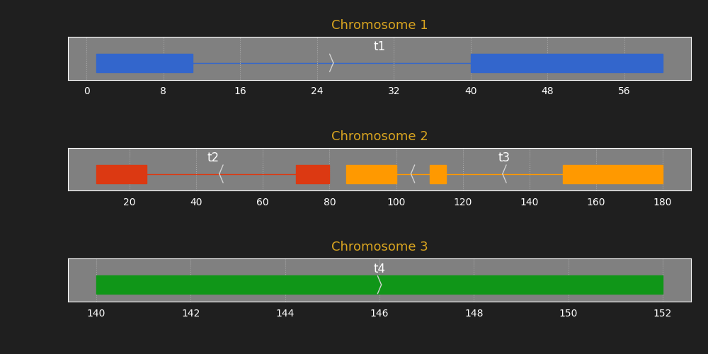

*Figure size: 1120 × 535 px (11.20 × 5.35 in).*
Reset options before continuing, so later examples do not inherit the dark theme:

    >>> pe.reset_options()

Managing space: pack/unpack, shrink
---------------------------------------

By default, pyrangeyes tries to save as much vertical space as possible,
so the transcripts are placed one beside the other, in a "pack" disposition.
To instead display one transcript per row, set the ``pack`` parameter as ``False``:

    >>> pe.plot(x, pack=False)

*Matplotlib engine*

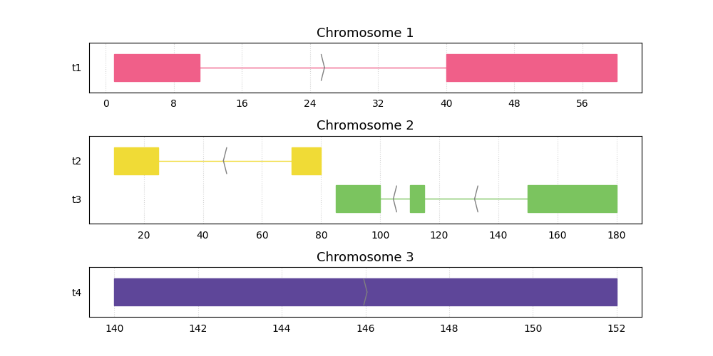

*Figure size: 1120 × 528 px (11.20 × 5.28 in).*
When ``pack=False``, rows are shown in the first-seen order of the input by default.
This is useful when a PyRanges object was assembled by concatenating groups in a specific order,
or when the order of rows already carries meaning. To instead let pyrangeyes order groups by
its genomic sorting behavior, pass ``sort_ranges=True``.

Pyrangeyes offers the option to reduce horizontal space, occupied by introns or intergenic regions,
by activating the ``shrink`` parameter.
The  ``shrink_threshold`` determines the minimum length of a region without visible intervals to be shrunk.
When a float is provided, it will be interpreted as a fraction of the visible coordinate limits,
while when an int is given it will be interpreted as number of base pairs.

Then compare the unshrunk and shrunk views::

    >>> ppp = pe.example_data.p3
    >>> pe.plot(ppp, label=False)

*Matplotlib engine*

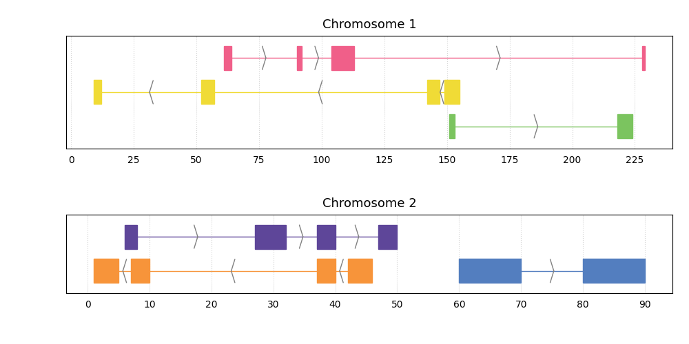

*Figure size: 1120 × 577 px (11.20 × 5.77 in).*
::

    >>> pe.plot(ppp, shrink=True, label=False)

*Matplotlib engine*

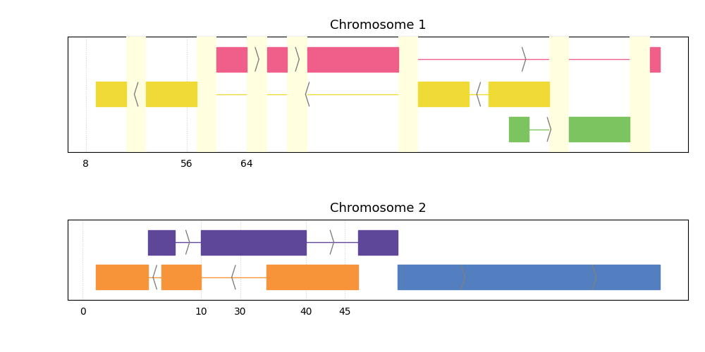

*Figure size: 1120 × 577 px (11.20 × 5.77 in).*
Displaying multiple tracks
--------------------------

Pass a list of PyRanges objects, or ``Track`` objects, to display multiple tracks.
When a colormap is provided globally, pyrangeyes builds one shared mapping across
tracks that do not define their own colormap. This keeps colors unambiguous even
when tracks use different ID columns.

    >>> regions = pr.PyRanges(
    ...     {
    ...         "Chromosome": [1, 1, 2, 2],
    ...         "Start": [15, 75, 35, 130],
    ...         "End": [30, 95, 55, 165],
    ...         "group": ["g1", "g2", "g3", "g4"],
    ...     }
    ... )
    >>> pe.plot(
    ...     [
    ...         pe.Track(x),
    ...         pe.Track(regions, id_col="group", pack=False, outline_color="black"),
    ...     ],
    ...     colormap="Dark2",
    ...     legend=True,
    ... )

*Matplotlib engine*

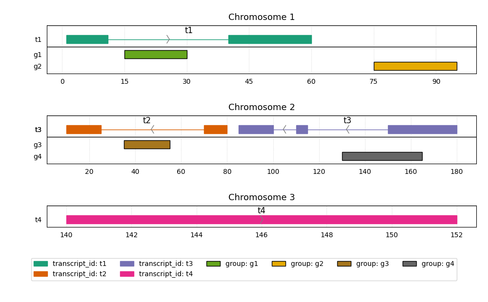

*Figure size: 1120 × 1258 px (11.20 × 12.58 in).*
Track-specific options override plot defaults for only that track. Use them for
per-track coloring, compact squished tracks, and labels based on each track's ID:

    >>> pe.plot(
    ...     [
    ...         pe.Track(
    ...             x,
    ...             name="Transcripts",
    ...             id_col="transcript_id",
    ...             track_bg="rgb(225, 245, 255)",
    ...             colormap="viridis",
    ...             label="{transcript_id}",
    ...         ),
    ...         pe.Track(
    ...             regions,
    ...             name="Regions",
    ...             id_col="group",
    ...             track_bg="rgb(255, 235, 215)",
    ...             colormap=["brown"],
    ...             squish=True,
    ...             label="{group}",
    ...         ),
    ...     ],
    ...     legend=True,
    ... )

*Matplotlib engine*

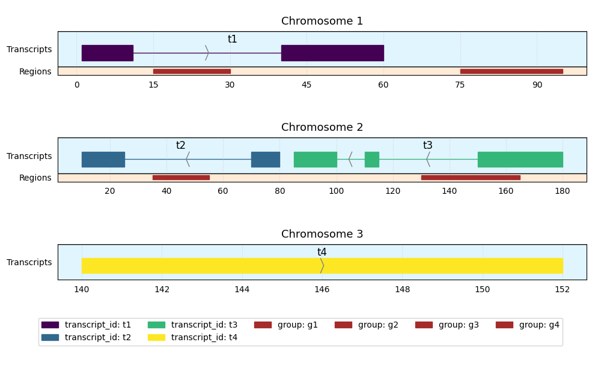

*Figure size: 1120 × 657 px (11.20 × 6.57 in).*
If a track specifies its own ``colormap``, that track gets an independent mapping,
even when the colormap name is the same as another track's.

mRNA, SNPs, and other adapter views
-----------------------------------

Adapters are shortcuts to useful representations. They prepare domain-specific
inputs with sensible defaults before plotting, and are often most useful in
multi-track views.

The ``mRNA`` adapter shows CDS regions thicker than UTR/exon regions. The ``SNP``
adapter draws fixed-size markers for single-position variants. Here both adapters
are combined as tracks:

    >>> mrna = pe.example_data.mrna1
    >>> snps = pe.example_data.snps1
    >>> pe.plot(
    ...     [
    ...         pe.Track(mrna, "mRNA", name="mRNA"),
    ...         pe.Track(snps, "SNP", name="SNPs", shape="diamond", fill_col="ALT"),
    ...     ],
    ...     legend=True,
    ... )

*Matplotlib engine*

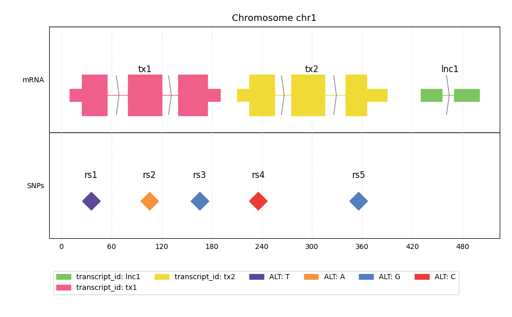

*Figure size: 1120 × 308 px (11.20 × 3.08 in).*
List all available adapters with ``pe.adapters.describe()`` and inspect adapter
options with ``pe.print_options(adapter="mRNA")``.

Tooltips and panel titles
-------------------------

In interactive plots, hover over intervals to see their coordinates, strand, and ID.
Add columns with ``tooltip`` templates, and customize panel titles with ``panel_title``:

    >>> pe.plot(
    ...     x,
    ...     tooltip="first feature: {feature1}\nsecond feature: {feature2}",
    ...     panel_title="Chr: {chrom}",
    ... )

*Matplotlib engine*

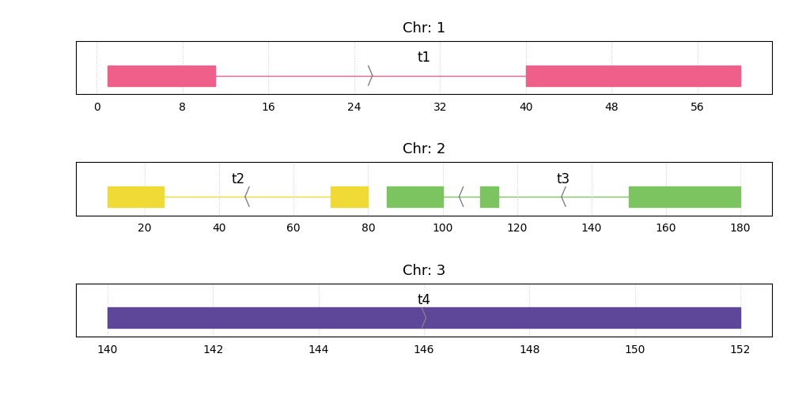

*Figure size: 1120 × 535 px (11.20 × 5.35 in).*
Adding aligned plots
--------------------

Use ``add_aligned_plots`` to add Plotly traces aligned to the genomic x-axis.
Here an mRNA track and SNP track are shown with a scatter plot of SNP scores.
See :func:`make_scatter() <pyrangeyes.make_scatter>` for scatter helper options.

    >>> snps1 = pr.PyRanges(
    ...     {
    ...         "Chromosome": ["chr1", "chr1", "chr1"],
    ...         "Start": [35, 105, 235],
    ...         "End": [36, 106, 236],
    ...         "ID": ["rs1", "rs2", "rs3"],
    ...         "ALT": ["T", "A", "G"],
    ...         "score": [0.2, 0.8, 0.5],
    ...     }
    ... )
    >>> aligned = pe.make_scatter(snps1, y="score", title="SNP score", engine="ply")
    >>> pe.plot([pe.Track(mrna, "mRNA"), pe.Track(snps1, "SNP")], add_aligned_plots=[aligned])

*Matplotlib engine*

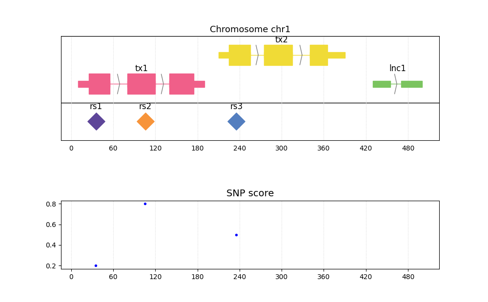

*Figure size: 1120 × 583 px (11.20 × 5.83 in).*
Integrating Pyrangeyes with External Visualizations
---------------------------------------------------

For custom dashboards, return the Plotly/Dash object with ``return_plot="app"``
and compose it with other Dash components.

    >>> from dash import dcc, html
    >>> import plotly.graph_objects as go
    >>> app = pe.plot([pe.Track(mrna, "mRNA"), pe.Track(snps1, "SNP")], return_plot="app")
    >>> pie = go.Figure(go.Pie(labels=["A", "T", "G"], values=[1, 1, 1]))
    >>> app.layout = html.Div([app.layout, dcc.Graph(figure=pie)])

*Plotly engine*

.. image:: images/prp_rtd_27.png

*Figure size: 1120 × 290 px (11.20 × 2.90 in).*
